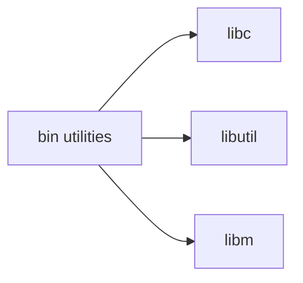

# bin/ — Essential Binaries Codebase Map

**Path:** `bin/`
**Purpose:** Essential userland utilities

## Overview

The bin directory contains essential command-line utilities that are part of the base FreeBSD system.

## Commands (25 total)

| Command | Purpose |
|---------|---------|
| `cat` | Concatenate and display files |
| `chflags` | Change file flags |
| `chio` | Change file I/O ownership |
| `chmod` | Change file mode |
| `cp` | Copy files |
| `cpuset` | Set CPU affinity |
| `csh` | C shell |
| `date` | Display date/time |
| `dd` | Data copy/convert |
| `df` | Display disk usage |
| `domainname` | Set/get domain name |
| `echo` | Display text |
| `ed` | Line editor |
| `expr` | Expression evaluator |
| `freebsd-version` | Print FreeBSD version |
| `getfacl` | Get ACL entries |
| `hostname` | Set/get hostname |
| `kenv` | Kernel environment |
| `kill` | Send signal to process |
| `ln` | Create links |
| `ls` | List directory contents |
| `mkdir` | Make directories |
| `mv` | Move files |
| `ps` | Process status |
| `pwd` | Print working directory |
| `rm` | Remove files |
| `rmdir` | Remove directories |
| `setfacl` | Set ACL entries |
| `sh` | Bourne shell |
| `sleep` | Delay for specified time |
| `stty` | Set terminal options |
| `sync` | Flush filesystem buffers |
| `test` | Condition evaluation |
| `touch` | Change file timestamps |

## Shell Scripts

| Script | Purpose |
|--------|---------|
| `mail` | Send mail |

## Dependencies

## See Also

- `sbin/` - System administration binaries
- `usr.bin/` - User utilities
- `usr.sbin/` - System administration