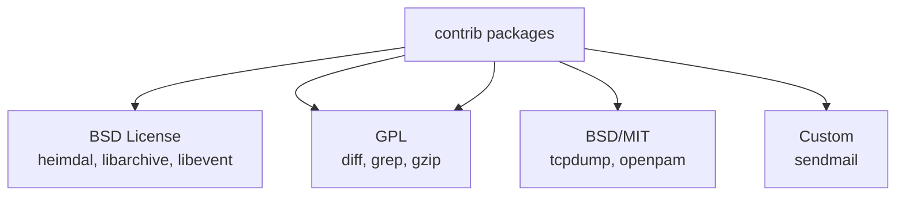

# contrib/ — Third-Party Contributions Codebase Map

**Path:** `contrib/`
**Purpose:** Third-party software with BSD-compatible licenses

## Overview

The contrib directory contains third-party software that has been ported to FreeBSD. Many packages are from the BSD projects (NetBSD, OpenBSD) or have BSD-compatible licenses.

## Major Packages (92 total)

### Text Processing

| Package | Description |
|---------|-------------|
| `diff/` | Text diff utility (GNU) |
| `diffutils/` | diff, sdiff, cmp |
| `ed/` | Editor |
| `grep/` | Pattern matching |
| `gzip/` | Compression |
| `patch/` | Apply patches |
| `sed/` | Stream editor |
| `tar/` | Archive utility |
| `texinfo/` | Documentation |

### Security

| Package | Description |
|---------|-------------|
| `heimdal/` | Kerberos 5 |
| `libpcap/` | Packet capture |
| `tcpdump/` | Network analyzer |
| `openpam/` | PAM library |
| `bsnmp/` | SNMP library |

### Networking

| Package | Description |
|---------|-------------|
| `bIND/` | DNS server |
| `sendmail/` | Mail Transfer Agent |
| `ipfilter/` | IP filter |
| `pf/` | Packet filter |

### Libraries

| Package | Description |
|---------|-------------|
| `libiconv/` | Character conversion |
| `libpthread/` | POSIX threads |
| `libz/` | Compression |
| `file/` | File type detection |

### Utilities

| Package | Description |
|---------|-------------|
| `top/` | Process viewer |
| ` less/` | Pager |
| `nvi/` | Vi editor |
| `m4/` | Macro processor |
| `make/` | Build utility |

### FreeBSD/NetBSD Derived

| Package | Description |
|---------|-------------|
| `libarchive/` | Archive library |
| `libevent/` | Event library |
| `libfetch/` | URL fetching |
| `libedit/` | Line editing |
| `ncurses/` | Terminal UI |
| `getline/` | Line reading |

## License Compatibility

## See Also

- `crypto/` - Cryptographic software
- `third-party/` - Other third-party
- `gnu/` - GNU software