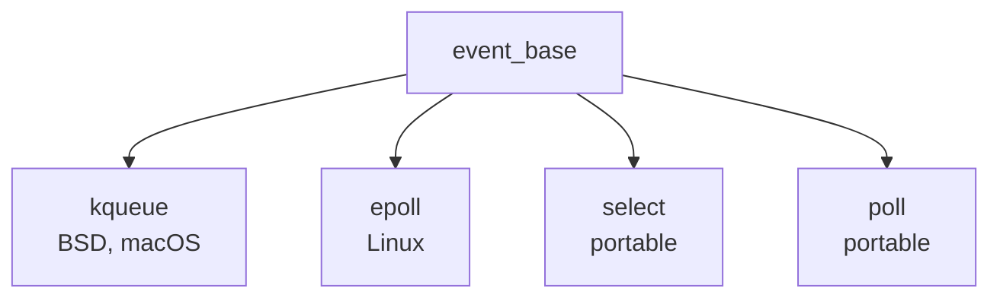

# contrib/libevent/ — Libevent Source Codebase Map

**Path:** `contrib/libevent/`
**Purpose:** Event library source

## Overview

libevent provides event notification for network applications.

## Key Files

| File | Purpose |
|------|---------|
| `event.c` | Core event |
| `event-internal.h` | Internal |
| `epoll.c` | epoll |
| `kqueue.c` | kqueue |
| `select.c` | select |
| `poll.c` | poll |
| `evbuffer.c` | Buffers |
| `evthread.c` | Threading |
| `listener.c` | TCP listener |
| `bufferevent/` | Buffered I/O |

## Event Backends

## See Also

- `lib/libevent/` - FreeBSD integrated