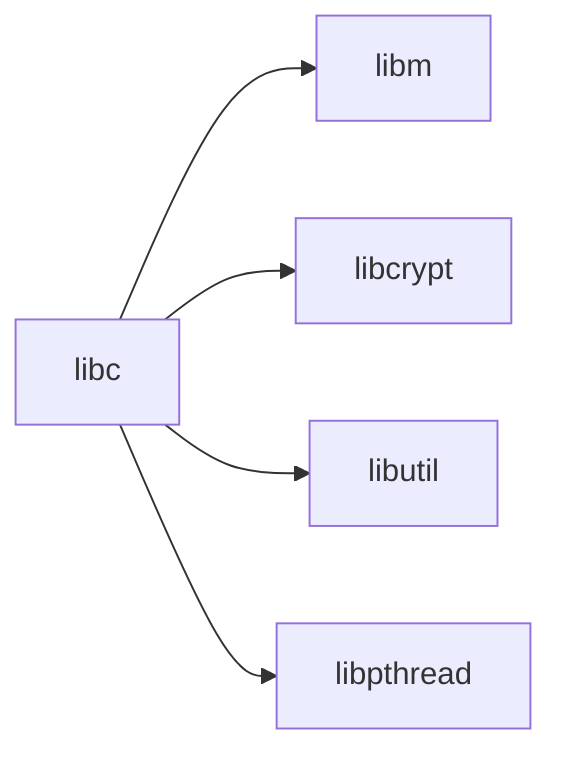

# lib/ — C Library Source Codebase Map

**Path:** `lib/`
**Purpose:** Standard C library and support libraries

## Overview

The lib directory contains the C library source code and additional libraries.

## Directory Structure

```
lib/
├── libc/            # Standard C library
├── libm/            # Math library (legacy, use msun)
├── msun/            # Math library
├── libpthread/      # POSIX threads
├── libthr/          # GNU libpthread
├── libmd/           # Message digest
├── libcrypt/        # Crypt
├── libelf/          # ELF handling
├── libedit/         # Line editing
├── libfetch/        # URL fetch
├── libpcap/         # Packet capture
└── ...
```

## Key Libraries

### libc

| Component | Description |
|-----------|-------------|
| `string/` | String functions |
| `stdlib/` | Standard utilities |
| `stdio/` | I/O functions |
| `time/` | Time functions |
| `locale/` | Locale |
| `wchar/` | Wide char |
| `signal/` | Signal handling |
| `sys/` | System calls |
| `net/` | Network |
| `socket/` | Sockets |
| `posix/` | POSIX |

### msun

| Component | Description |
|-----------|-------------|
| `src/` | Math functions |
| `man/` | Manual pages |

### libpthread

| Component | Description |
|-----------|-------------|
| `thread/` | Thread impl |
| `proc/` | Process |

## Relationships



## See Also

- `libraries/` - Installed libraries