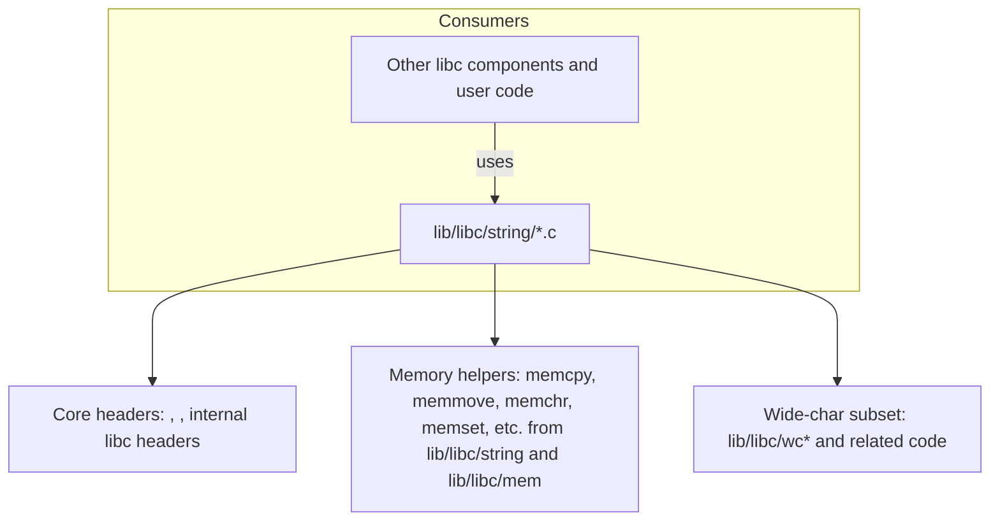

## lib/libc/string CODEBASE MAP

Overview:
- This subtree implements C string and related memory manipulation utilities used by the C standard library and higher-level libc components. It covers both narrow-character and wide-character variants, and includes both core string operations (strlen, strcpy, strcmp, etc.) and memory-oriented helpers (memcpy, memmove, memchr, etc.).

Relationship and dependencies:
- Includes standard C headers (e.g., <stddef.h>, <string.h> in some cases, and internal libc headers).
- Many functions depend on core memory helpers from lib/libc/string and lib/libc/mem (and, in some cases, wide-character subsystems in lib/libc/wchar).
- Other libc components (stdio, stdlib, etc.) rely on these string utilities for formatting, parsing, and data manipulation.

Mermaid relationship diagram (high level):

Notes:
- This map focuses on the string/ directory first (core string operations and their memory variants).)
- Per-function docs in the lib/libc/string directory are provided in dedicated Markdown files (e.g., strlen.md, strcpy.md, etc.).
