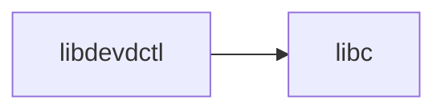

# lib/libdevdctl/ — Device Control Library Codebase Map

**Path:** `lib/libdevdctl/`
**Purpose:** Device control

## Overview

libdevdctl provides device control functionality.

## Key Files

| File | Purpose |
|------|---------|
| `devdctl.c` | Main |

## Relationships

## See Also

- `usr.sbin/devd/` - Device daemon