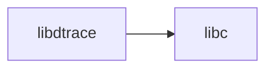

# lib/libdtrace/ — DTrace Library Codebase Map

**Path:** `lib/libdtrace/`
**Purpose:** DTrace support

## Overview

libdtrace provides DTrace support.

## Key Files

| File | Purpose |
|------|---------|
| `dtrace.c` | Main |

## Relationships

## See Also

- `cddl/usr.sbin/dtrace/` - DTrace