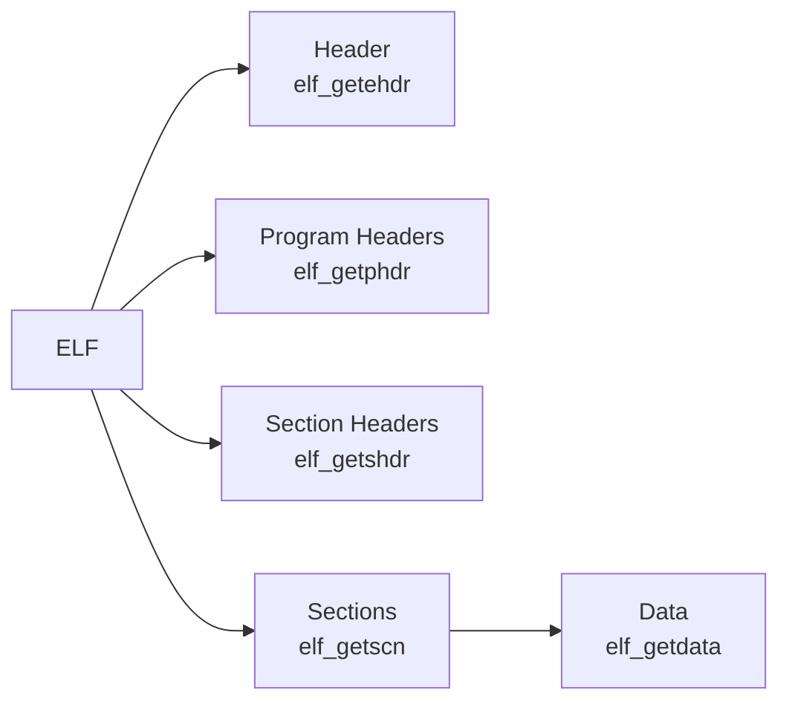

# lib/libelf/ — ELF Library Codebase Map

**Path:** `lib/libelf/`
**Purpose:** ELF file handling

## Overview

libelf provides functions for reading and writing ELF files.

## Key Files

| File | Purpose |
|------|---------|
| `elf.h` | Main header |
| `elf_begin.c` | Start iteration |
| `elf_end.c` | End iteration |
| `elf_next.c` | Next section |
| `elf_getident.c` | Get ident |
| `elf_getphdrnum.c` | Program headers |
| `elf_getshdrnum.c` | Section headers |
| `elf_update.c` | Update ELF |

## ELF Types

```c
typedef struct {
    unsigned char e_ident[16];
    uint16_t e_type;
    uint16_t e_machine;
    uint32_t e_version;
    uint64_t e_entry;
    uint64_t e_phoff;
    uint64_t e_shoff;
    uint32_t e_flags;
    uint16_t e_ehsize;
    uint16_t e_phentsize;
    uint16_t e_phnum;
    uint16_t e_shentsize;
    uint16_t e_shnum;
    uint16_t e_shstrndx;
} Elf64_Ehdr;
```

## Key Functions

```c
Elf *elf_begin(int fd, Elf_Cmd cmd, Elf *ref);
int elf_end(Elf *elf);
size_t elf_update(Elf *elf, Elf_Cmd cmd);

char *elf_getident(Elf *elf, size_t *n);
 Elf64_Ehdr *elf_getehdr(Elf *elf);
Elf64_Phdr *elf_getphdr(Elf *elf);
Elf64_Shdr *elf_getshdr(Elf *elf);

Elf_Scn *elf_getscn(Elf *elf, size_t index);
Elf_Data *elf_getdata(Elf_Scn *scn, Elf_Data *data);
```

## Sections



## See Also

- `sys/kern/link_elf.c` - Kernel ELF loader