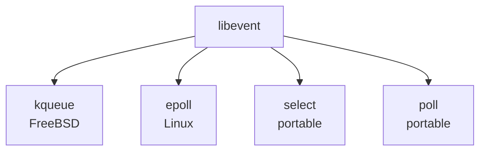

# lib/libevent/ — Event Library Codebase Map

**Path:** `lib/libevent/`
**Purpose:** Event notification library

## Overview

libevent provides asynchronous event notification for network servers.

## Key Files

| File | Purpose |
|------|---------|
| `event.c` | Core event loop |
| `evthread.c` | Threading |
| `epoll.c` | epoll backend |
| `kqueue.c` | kqueue backend |
| `select.c` | select backend |
| `evbuffer.c` | Buffer I/O |
| `evhttp.c` | HTTP |
| `evdns.c` | DNS |
| `evrpc.c` | RPC |

## Event Loop

```c
struct event_base *event_base_new(void);
int event_base_dispatch(struct event_base *);
int event_base_loop(struct event_base *, int);
void event_base_free(struct event_base *);
```

## Events

```c
struct event *event_new(struct event_base *, evutil_socket_t, short, event_callback_fn, void *);
int event_add(struct event *ev, const struct timeval *);
int event_del(struct event *);
int event_active(struct event *, int, short);
void event_free(struct event *);
```

## Buffers

```c
struct evbuffer *evbuffer_new(void);
int evbuffer_add(struct evbuffer *, const void *, size_t);
int evbuffer_remove(struct evbuffer *, void *, size_t);
```

## Backends



## See Also

- `sys/kern/uipc_socket.c` - Sockets