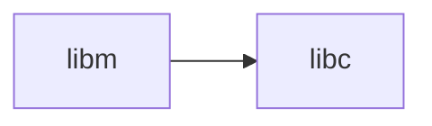

# lib/libm/ — Math Library Codebase Map

**Path:** `lib/libm/`
**Purpose:** Mathematical functions

## Overview

libm provides mathematical functions.

## Key Files

| File | Purpose |
|------|---------|
| `math.c` | Main |

## Relationships

## See Also

- `lib/libc/` - C library