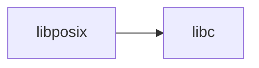

# lib/libposix/ — POSIX Library Codebase Map

**Path:** `lib/libposix/`
**Purpose:** POSIX compliance

## Overview

libposix provides POSIX compliance functions.

## Key Files

| File | Purpose |
|------|---------|
| `posix.c` | Main |

## Relationships

## See Also

- `lib/libc/` - C library