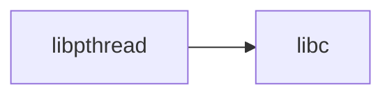

# lib/libpthread/ — POSIX Threads Library Codebase Map

**Path:** `lib/libpthread/`
**Purpose:** POSIX threads

## Overview

libpthread provides POSIX thread support.

## Key Files

| File | Purpose |
|------|---------|
| `pthread.c` | Main |
| `pthread_int.h` | Internal |

## Relationships

## See Also

- `lib/libc/` - C library