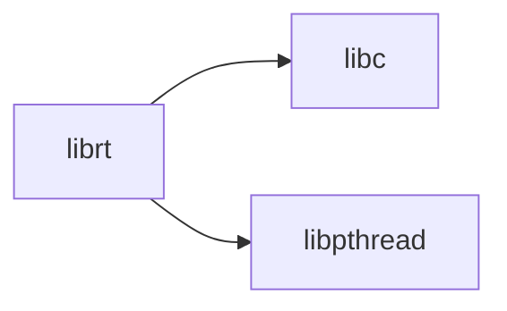

# lib/librt/ — POSIX Realtime Library Codebase Map

**Path:** `lib/librt/`
**Purpose:** Realtime extensions

## Overview

librt provides POSIX realtime extensions.

## Key Files

| File | Purpose |
|------|---------|
| `rt.c` | Main |

## Relationships

## See Also

- `lib/libc/` - C library
- `lib/libpthread/` - Threads