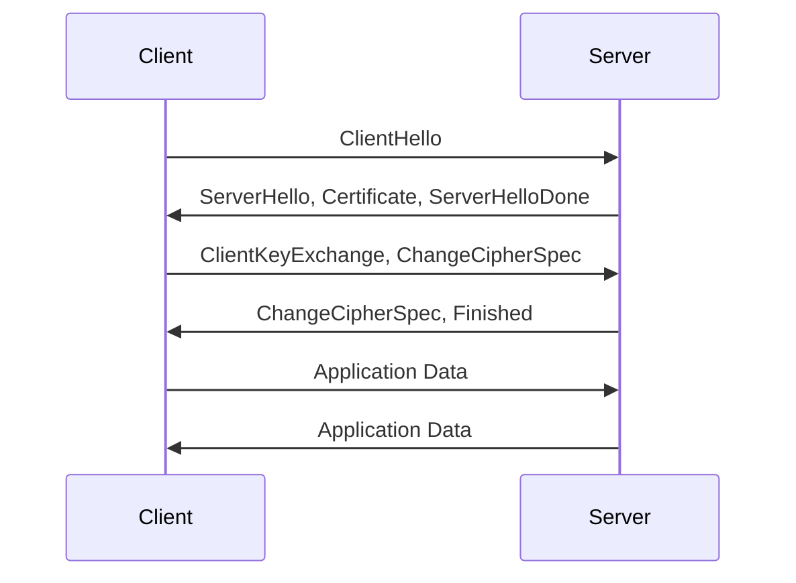

# lib/libssl/ — OpenSSL SSL/TLS Library Codebase Map

**Path:** `lib/libssl/`
**Purpose:** SSL and TLS protocol implementation

## Overview

libssl provides SSL/TLS protocol implementation.

## Key Files

| File | Purpose |
|------|---------|
| `ssl/ssl_lib.c` | Main SSL library |
| `ssl/ssl_init.c` | Initialization |
| `ssl/ssl_err.c` | Error handling |
| `ssl/ssl_cert.c` | Certificate handling |
| `ssl/ssl_sess.c` | Session handling |
| `ssl/t1_lib.c` | TLS 1.x |
| `ssl/d1_lib.c` | DTLS |
| `ssl/ ssl3_lib.c` | SSL 3.0 |
| `ssl/ ssl3_srv.c` | Server |
| `ssl/ssl3_clnt.c` | Client |

## SSL/TLS Methods

```c
// Methods
const SSL_METHOD *SSLv3_method(void);
const SSL_METHOD *TLSv1_method(void);
const SSL_METHOD *TLSv1_1_method(void);
const SSL_METHOD *TLSv1_2_method(void);
const SSL_METHOD *TLSv1_3_method(void);
const SSL_METHOD *DTLSv1_method(void);
const SSL_METHOD *DTLSv1_2_method(void);
```

## Context

```c
SSL_CTX *SSL_CTX_new(const SSL_METHOD *method);
void SSL_CTX_free(SSL_CTX *);

int SSL_CTX_use_certificate_file(SSL_CTX *, const char *, int);
int SSL_CTX_use_PrivateKey_file(SSL_CTX *, const char *, int);
int SSL_CTX_check_private_key(const SSL_CTX *);
```

## Connection

```c
SSL *SSL_new(SSL_CTX *);
void SSL_free(SSL *);

int SSL_set_fd(SSL *, int fd);
int SSL_accept(SSL *);
int SSL_connect(SSL *);
int SSL_read(SSL *, void *, int);
int SSL_write(SSL *, const void *, int);
```

## Protocol Flow



## See Also

- `lib/libcrypto/` - Crypto library