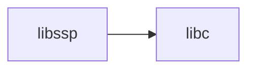

# lib/libssp/ — Stack Protector Library Codebase Map

**Path:** `lib/libssp/`
**Purpose:** Stack protection

## Overview

libssp provides stack smashing protection.

## Key Files

| File | Purpose |
|------|---------|
| `ssp.c` | Main |

## Relationships

## See Also

- `lib/libc/` - C library