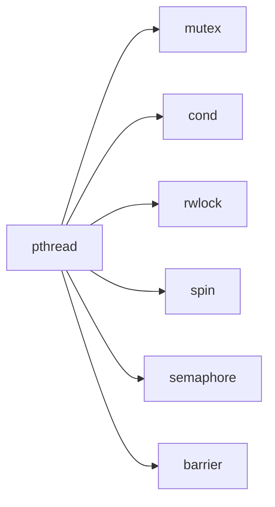

# lib/libthr/ — POSIX Threads Library Codebase Map

**Path:** `lib/libthr/`
**Purpose:** GNU libpthread (POSIX threads)

## Overview

libthr provides POSIX thread support for FreeBSD.

## Key Files

| File | Purpose |
|------|---------|
| `thr_create.c` | Thread creation |
| `thr_exit.c` | Thread exit |
| `thr_join.c` | Thread join |
| `thr_mutex.c` | Mutex implementation |
| `thr_rwlock.c` | Read-write lock |
| `thr_cond.c` | Condition variables |
| `thr_sem.c` | Semaphores |
| `thr_spin.c` | Spin locks |
| `thr_barrier.c` | Barriers |
| `thr_sig.c` | Thread signals |
| `thr_private.c` | TLS |

## Thread Functions

```c
int pthread_create(pthread_t *, const pthread_attr_t *, void *(*)(void *), void *);
void pthread_exit(void *) __attribute__((noreturn));
int pthread_join(pthread_t, void **);
int pthread_detach(pthread_t);

int pthread_mutex_init(pthread_mutex_t *, const pthread_mutexattr_t *);
int pthread_mutex_lock(pthread_mutex_t *);
int pthread_mutex_trylock(pthread_mutex_t *);
int pthread_mutex_unlock(pthread_mutex_t *);

int pthread_cond_init(pthread_cond_t *, const pthread_condattr_t *);
int pthread_cond_wait(pthread_cond_t *, pthread_mutex_t *);
int pthread_cond_signal(pthread_cond_t *);
int pthread_cond_broadcast(pthread_cond_t *);

int pthread_rwlock_init(pthread_rwlock_t *, const pthread_rwlockattr_t *);
int pthread_rwlock_rdlock(pthread_rwlock_t *);
int pthread_rwlock_wrlock(pthread_rwlock_t *);
int pthread_rwlock_unlock(pthread_rwlock_t *);
```

## Synchronization



## See Also

- `lib/libc_r/` - libc r (old pthread)
- `sys/kern/kern_kthread.c` - Kernel threads