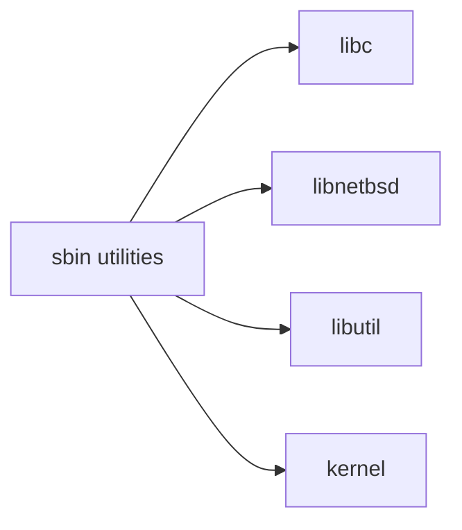

# sbin/ — System Administration Binaries Codebase Map

**Path:** `sbin/`
**Purpose:** System administration utilities

## Overview

The sbin directory contains system administration and configuration commands.

## Key Commands

| Command | Purpose |
|---------|---------|
| `adjkerntz` | Adjust kernel time zone |
| `bectl` | Boot environment control |
| `bsdlabel` | Read/write disk label |
| `camcontrol` | CAM device control |
| `ccdconfig` | Configure concatenated disk |
| `clri` | Clear inode |
| `comcontrol` | Serial port control |
| `conscontrol` | Console control |
| `ddb` | DDB debugger commands |
| `decryptcore` | Decrypt kernel core dump |
| `devd` | Device daemon |
| `devfs` | Device filesystem control |
| `devmatch` | Match devices |
| `dhclient` | DHCP client |
| `dmesg` | Display kernel message buffer |
| `dump` | Dump filesystem |
| `dumpfs` | Dump filesystem info |
| `dumpon` | Enable crash dumps |
| `etherswitchcfg` | Ethernet switch config |
| `fdisk` | Partition editor |
| `fsck` | Filesystem check |
| `fsdb` | Filesystem debugger |
| `fsirand` | Randomize inode numbers |
| `gbde` | GEOM-based disk encryption |
| `geom` | GEOM utility |
| `gpart` | Partitioning utility |
| `halt` | Shutdown system |
| `ifconfig` | Configure network interface |
| `init` | System initialization |
| `ipfw` | IP firewall |
| `kldconfig` | Configure kernel modules |
| `kldload` | Load kernel module |
| `kldstat` | Kernel module status |
| `kldunload` | Unload kernel module |
| `life` | Life editor (game) |
| `md5` | MD5 checksum |
| `mdconfig` | Configure memory disk |
| `mdmfs` | Memory disk filesystem |
| `mknod` | Make device node |
| `mount` | Mount filesystem |
| `mount_cd9660` | Mount ISO9660 |
| `mount_ext2fs` | Mount ext2fs |
| `mount_msdosfs` | Mount FAT |
| `mount_nfs` | Mount NFS |
| `mount_ntfs` | Mount NTFS |
| `mount_nullfs` | Mount null filesystem |
| `mount_udf` | Mount UDF |
| `mount_unionfs` | Mount union filesystem |
| `natd` | Network Address Translation |
| `newfs` | New filesystem |
| `nextboot` | Next boot configuration |
| `nfsiod` | NFS async I/O daemon |
| `nfscbd` | NFS callback daemon |
| `nfsd` | NFS server daemon |
| `nfsrvd` | NFS server (old) |
| `panic` | Kernel panic |
| `pfctl` | Packet filter control |
| `ping` | ICMP ping |
| `powerd` | Power management |
| `pwd_mkdb` | Build password database |
| `rcorder` | Service ordering |
| `rdump` | Remote dump |
| `reboot` | Reboot system |
| `regdomain` | Radio regulation domain |
| `restore` | Restore filesystem |
| `rmt` | Remote tape operation |
| `route` | Routing table |
| `routed` | RIP routing daemon |
| `rrdump` | Remote restore dump |
| `rtquery` | Routing query |
| `rtsol` | IPv6 router solicitation |
| `savecore` | Save crash dump |
| `scancheck` | Scan filesystem check |
| `scu` | CAM SCSI utility |
| `setkey` | IPsec key management |
| `shutdown` | Shutdown system |
| `slapadd` | LDAP add |
| `slapcat` | LDAP catalog |
| `slapindex` | LDAP index |
| `slapd` | LDAP daemon |
| `slapschema` | LDAP schema |
| `slapwallet` | LDAP password wallet |
| `spkrdev` | Speaker device |
| `strace` | System call trace |
| `swapinfo` | Swap information |
| `sysctl` | Get/set system variables |
| `syslogd` | System log daemon |
| `tail` | Display file end |
| `tcpdchk` | TCP wrapper check |
| `tcpdmatch` | TCP wrapper predict |
| `tcpslice` | Time-based slice |
| `traceroute` | Trace route |
| `trpt` | Transport trace |
| `truncate` | Truncate file |
| `tty` | Get tty name |
| `umount` | Unmount filesystem |
| `unload` | Unload kernel modules |
| `vidcontrol` | Video control |
| `vipw` | Edit password file |
| `wdctl` | Watchdog control |
| `wg` | WireGuard |

## Dependencies

## See Also

- `bin/` - Essential binaries
- `usr.sbin/` - Additional system utilities