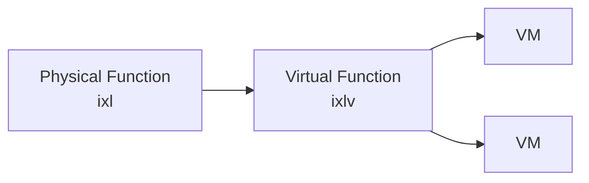

# sys/dev/ixlv/ — Intel XL710 Virtual Function Codebase Map

**Path:** `sys/dev/ixlv/`
**Purpose:** Intel XL710 VF driver for SR-IOV

## Overview

The ixlv driver supports the Intel XL710 Virtual Function for SR-IOV.

## Key Files

| File | Purpose |
|------|---------|
| `if_ixlv.c` | Main driver |
| `if_ixlv.h` | Header |

## Relationship to PF

## See Also

- `sys/dev/ixl/` - Intel XL710 PF