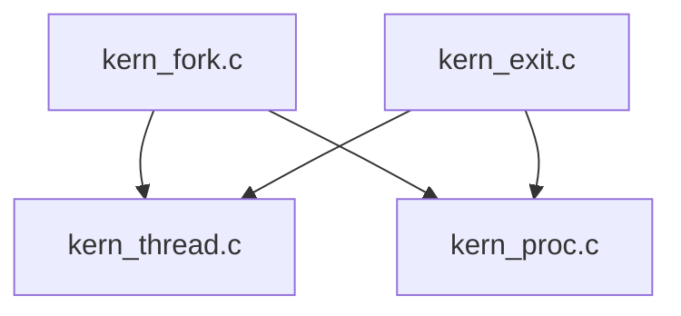
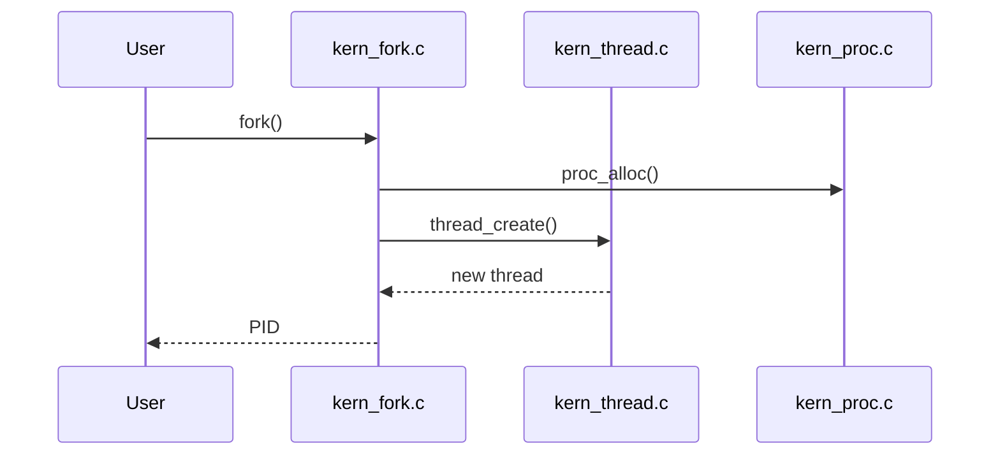
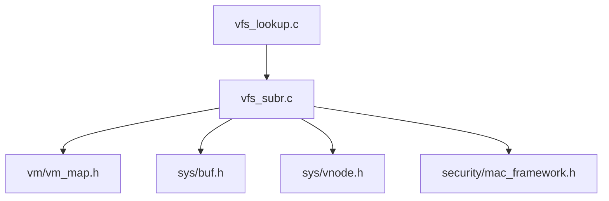

# sys/kern/ — Kernel Core Codebase Map

**Path:** `sys/kern/`
**Files:** 100+ C source files
**Purpose:** Core kernel functionality

## Overview

The `sys/kern/` directory contains the heart of the FreeBSD kernel. It handles process lifecycle, system calls, VFS operations, virtual memory coordination, synchronization primitives, and core system services.

## Major Subsystems

### 1. Process & Thread Management

| File | Purpose | Key Functions |
|------|---------|---------------|
| `kern_fork.c` | Process creation | `fork()`, `rfork()`, `vfork()` |
| `kern_exit.c` | Process termination | `exit()`, `kern_exit()` |
| `kern_thread.c` | Thread management | `thread_create()`, `thread_exit()` |
| `kern_proc.c` | Process state | `proc_alloc()`, `proc_reap()` |
| `kern_kthread.c` | Kernel threads | `kthread_add()`, `kthread_exit()` |

**Relationships:**



**Call Graph:**



### 2. System Call Interface

| File | Purpose | Key Structures |
|------|---------|----------------|
| `init_sysent.c` | Syscall table | `sysent[]` array |
| `syscall.c` | Syscall dispatch | `syscall()` function |
| `sys/syscall.h` | Syscall numbers | `SYS_xxx` constants |
| `sys/sysproto.h` | Syscall arguments | `struct proc`, `struct thread` |

**Syscall Flow:**


### 3. Virtual Filesystem (VFS)

| File | Purpose | Key Structures |
|------|---------|----------------|
| `vfs_subr.c` | VFS core | `struct vnode`, `struct mount` |
| `vfs_lookup.c` | Path lookup | `namei()`, `lookup()` |
| `vfs_vnops.c` | Vnode operations | `vn_*` functions |
| `vfs_mount.c` | Mount operations | `vfs_mount()`, `vfs_unmount()` |
| `vfs_syscalls.c` | VFS syscalls | `sys_chdir()`, `sys_mount()` |

**VFS Dependencies:**



### 4. Memory Management Coordination

| File | Purpose | Interfaces |
|------|---------|------------|
| `kern_malloc.c` | Kernel memory | `malloc()`, `free()` |
| `kern_vm.c` | VM system calls | `sbrk()`, `mmap()` |
| `vm/vm_map.c` | Address space | (in sys/vm/) |
| `vm/vm_page.c` | Physical pages | (in sys/vm/) |

**Kernel includes VM headers:**
```c
#include <vm/vm.h>
#include <vm/vm_map.h>
#include <vm/vm_page.h>
#include <vm/pmap.h>
```

### 5. Synchronization Primitives

| File | Purpose | Lock Types |
|------|---------|------------|
| `kern_lock.c` | Giant lock | `struct lock` |
| `kern_mutex.c` | Mutex | `struct mtx` |
| `kern_rwlock.c` | Read-write lock | `struct rwlock` |
| `kern_sx.c` | Shared/exclusive | `struct sx` |
| `kern_condvar.c` | Condition variable | `struct cv` |
| `subr_turnstile.c` | Turnstiles | `struct turnstile` |
| `subr_witness.c` | Lock order verification | witness framework |

**Lock Order (partial):**


### 6. Time & Scheduling

| File | Purpose | Key Functions |
|------|---------|---------------|
| `kern_time.c` | Time management | `getmicrotime()`, `getbintime()` |
| `kern_clock.c` | Clock interrupts | `hardclock()`, `softclock()` |
| `sched_ule.c` | ULE scheduler | default FreeBSD scheduler |
| `sched_4bsd.c` | 4BSD scheduler | legacy scheduler |
| `kern_tc.c` | Timecounter | `tc_init()`, `tc_setclock()` |

### 7. I/O Subsystem

| File | Purpose | Key Structures |
|------|---------|----------------|
| `kern_conf.c` | Console | `cnopen()`, `cnread()` |
| `tty.c` | TTY framework | `struct tty`, `tty_*` |
| `tty_ttydisc.c` | Line discipline | `ttydisc_*` |
| `subr_disk.c` | Disk devices | `disk_alloc()`, `disk_destroy()` |

### 8. System V IPC

| File | Purpose |
|------|---------|
| `sysv_ipc.c` | Shared memory, semaphores, messages |
| `sysv_sem.c` | Semaphore operations |
| `sysv_shm.c` | Shared memory operations |
| `sysv_msg.c` | Message queue operations |

## Key Data Structures

### Process Structure (`struct proc`)
```c
// Defined in sys/proc.h
struct proc {
    structthread *p_threads;      // Threads in this process
    struct filedesc *p_fd;        // File descriptor table
    struct vmspace *p_vmspace;   // Address space
    struct proc *p_pptr;         // Parent process
    struct list p_children;       // Child processes
    struct siginfo *p_siginfo;   // Signal state
    // ... many more fields
};
```

### Thread Structure (`struct thread`)
```c
// Defined in sys/thread.h
struct thread {
    struct proc *td_proc;         // Owner process
    struct pcb *td_pcb;           // CPU state
    ucontext_t *td_ucxt;          // User context
    void *td_stack;               // Kernel stack
    int td_priority;              // Scheduling priority
    // ... many more fields
};
```

### Vnode Structure (`struct vnode`)
```c
// Defined in sys/vnode.h
struct vnode {
    struct mount *v_mount;        // Filesystem mount point
    struct vop_vector *v_op;      // Vnode operations
    enum vtype v_type;            // File type
    struct ucred *v_cred;         // Credentials
    // ... more fields
};
```

### Mount Structure (`struct mount`)
```c
// Defined in sys/mount.h
struct mount {
    struct vfsops *mnt_op;       // Filesystem operations
    struct vnode *mnt_devvp;     // Device vnode
    struct label *mnt_label;      // MAC label
    char *mnt_statfsbuf;         // Statfs buffer
    // ... more fields
};
```

## Include Dependencies (Key Headers)

```
sys/kern/
├── systm.h          # Core kernel definitions (malloc, printf, etc.)
├── proc.h           # Process structure
├── thread.h         # Thread structure
├── vnode.h         # Vnode interface
├── mount.h          # Mount structure
├── buf.h            # Buffer cache
├── lock.h           # Lock primitives
├── mutex.h          # Mutex operations
├── vm_map.h         # Virtual memory map
├── sched.h          # Scheduler interface
└── sysent.h        # Syscall table entries
```

## Initialization Sequence (init_main.c)

1. `mi_startup()` - machine-independent startup
2. `kinit()` - kernel subsystems init:
   - `kinit_vm()` - VM system
   - `kinit_proc()` - process 0 creation
   - `kinit_XXX()` - other subsystems
3. `fork_exit()` - create init process
4. `cpu_idle()` - enter idle loop

## Major Subsystem Relationships

```
┌─────────────────────────────────────────────────────────────┐
│                         USERLAND                             │
└─────────────────────────────────────────────────────────────┘
                              │ syscall/trap
                              ▼
┌─────────────────────────────────────────────────────────────┐
│              syscall.c:syscall()                            │
│         (dispatches to sysent[SYS_xxx].sy_call)            │
└─────────────────────────────────────────────────────────────┘
         │              │              │              │
         ▼              ▼              ▼              ▼
┌─────────────┐  ┌─────────────┐  ┌─────────────┐  ┌─────────────┐
│  kern_fork  │  │  kern_exit │  │  vfs_*     │  │  uipc_*    │
│  kern_proc  │  │  kern_thread│  │  vfs_subr  │  │  uipc_socket│
└─────────────┘  └─────────────┘  └─────────────┘  └─────────────┘
         │              │              │              │
         ▼              ▼              ▼              ▼
┌─────────────────────────────────────────────────────────────┐
│                         VM (sys/vm/)                        │
│              vm_map.c, vm_page.c, pmap.c                   │
└─────────────────────────────────────────────────────────────┘
```

## Key Syscall Categories

| Category | Syscalls | Files |
|----------|----------|-------|
| Process | fork, exec, exit, wait, kill | kern_fork, kern_exit, kern_sig |
| Filesystem | open, read, write, close, mount | vfs_syscalls, vfs_subr |
| Memory | mmap, sbrk, mprotect | kern_vm |
| Communication | socket, connect, send, recv | uipc_socket |
| Time | gettimeofday, settimeofday, nanosleep | kern_time |

## Locking Overview

- **Giant Lock (` Giant`)** - historically single big lock, now mostly partitioned
- **Per-CPU locks** - for scheduler, stats
- **Vnode locks** - filesystem lock order
- **Spin locks** - for interrupt handlers

Lock order for most VFS operations:
```
proc_lock → filedesc_lock → vnode_lock → buf_lock
```

## Subroutines (`subr_*` files)

| File | Purpose |
|------|---------|
| `subr_atomic.c` | Atomic operations |
| `subr_bus.c` | Busdma framework |
| `subr_clock.c` | Clock operations |
| `subr_cpufreq.c` | CPU frequency scaling |
| `subr_devsw.c` | Device switch |
| `subr_intr.c` | Interrupt handling |
| `subr_ktest.c` | Kernel testing |
| `subr_lock.c` | Lock debugging |
| `subr_mbuf.c` | Network mbufs |
| `subr_module.c` | Kernel module loading |
| `subr_param.c` | Kernel parameters |
| `subr_pcpu.c` | Per-CPU data |
| `subr_percpu.c` | Per-CPU allocations |
| `subr_pcpu.c` | PCPU macros |
| `subr_prof.c` | Kernel profiling |
| `subr_rman.c` | Resource management |
| `subr_smp.c` | SMP primitives |
| `subr_taskqueue.c` | Task queues |
| `subr_trap.c` | Trap handling |
| `subr_uio.c` | I/O vector operations |
| `subr_vmem.c` | Virtual memory allocator |
| `subr_watchdog.c` | Watchdog timers |

## Image Activators (`imgact_*`)

| File | Format |
|------|--------|
| `imgact_elf.c` | ELF (primary) |
| `imgact_elf64.c` | ELF64 |
| `imgact_elf32.c` | ELF32 |
| `imgact_aout.c` | a.out (legacy) |
| `imgact_binmisc.c` | Binary interpreters |
| `imgact_shell.c` | Shell scripts |

## Architecture-Specific

`sys/kern/` is primarily machine-independent. Architecture-specific code lives in:
- `sys/amd64/` - AMD64-specific (syscall entry, trap frames)
- `sys/i386/` - i386-specific
- `sys/arm/` - ARM-specific
- `sys/arm64/` - ARM64-specific
- `sys/riscv/` - RISC-V-specific