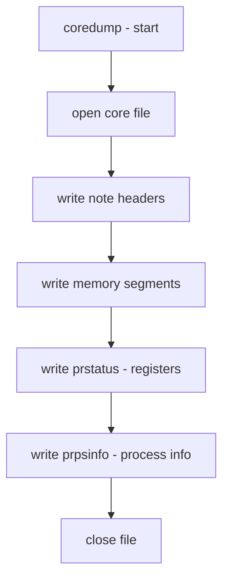

# Component: coredump_vnode.c

**Path:** `sys/kern/coredump_vnode.c`
**Type:** File
**Maps to:** `.discovery/sys/kern/coredump_vnode.md`

## Purpose

Core dump to vnode - writes process core dumps to files. Handles core file generation when a process crashes, writing memory pages and register state to a core file.

## Structure

## Key Functions

| Function | Purpose | Signature |
|----------|---------|-----------|
| `coredump` | Write core dump | `int coredump(struct proc *p)` |
| `core_close` | Close core file | `static int core_close(...)` |
| `core_wrtab` | Write notes | `static int core_wrtab(...)` |
| `core_pathtovnode` | Path to vnode | `static struct vnode *core_pathtovnode(...)` |

## Core Dump Format

| Section | Description |
|---------|-------------|
| `elfhdr` | ELF header |
| `phdr` | Program headers |
| `prstatus` | Register state (NT_PRSTATUS) |
| `prpsinfo` | Process info (NT_PRPSINFO) |
| `note` | Auxiliary notes |
| `segment` | Memory segment |

## Core Dump Path

| Path | Description |
|------|-------------|
| `kern.corefile` | Core file path pattern |
| `%P` | Process ID |
| `%N` | Process name |
| `%U` | UID |

## Core Dump Flags

| Flag | Description |
|------|-------------|
| `COREDUMPcompress` | Compress core |
| `COREDUMPflop` | Dump to floppy |

## Core Dump Notes

| Type | Description |
|------|-------------|
| `NT_PRSTATUS` | Register state |
| `NT_PRPSINFO` | Process info |
| `NT_FPREGSET` | FPU registers |
| `NT_X86_SSE` | SSE registers |

## Includes

- `sys/proc.h` - Process definitions
- `sys/ptrace.h` - Process tracing

## Depends On

- `kern_sig.c` for signal handling
- `vfs/vnode.h` for file operations