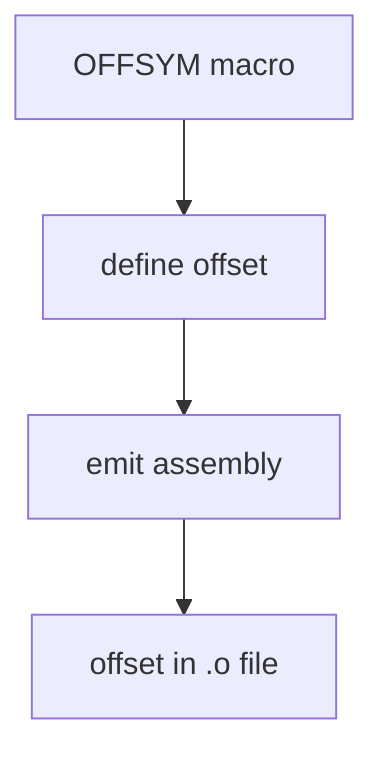

# Component: genoffset.c

**Path:** `sys/kern/genoffset.c`
**Type:** File
**Maps to:** `.discovery/sys/kern/genoffset.md`

## Purpose

Generate symbol offsets - creates compile-time constants for struct member offsets. Used by kernel to access struct members at known offsets without runtime calculation.

## Structure



## Key Macros

| Macro | Purpose | Signature |
|-------|---------|-----------|
| `OFFSYM` | Define offset | `OFFSYM(name, struct, member)` |
| `OFFSET` | Get offset | `OFFSET(struct, member)` |

## OFFSYM Usage

```c
OFFSYM(td_priority, thread, u_char);
OFFSYM(td_critnest, thread, u_int);
OFFSYM(td_owepreempt, thread, u_char);
```

## Generated Symbols

| Symbol | Description |
|--------|-------------|
| `td_priority` | Thread priority offset |
| `td_critnest` | Critical nesting level |
| `td_pinned` | Pinned CPU |

## Purpose

| Use | Description |
|-----|-------------|
| `assym.h` | Offset definitions |
| `kernel` | Fast struct access |

## Includes

- `sys/assym.h` - Assembly symbols

## Depends On

- `sys/proc.h` for thread struct