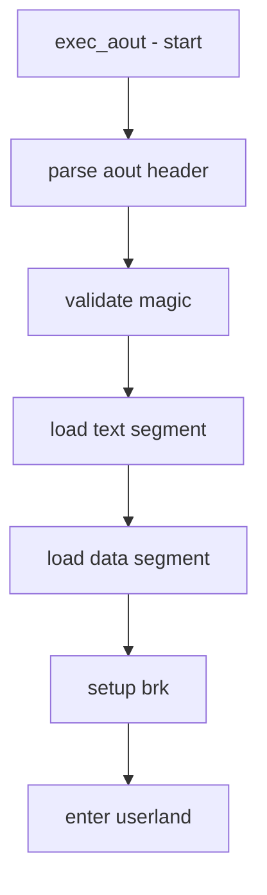

# Component: imgact_aout.c

**Path:** `sys/kern/imgact_aout.c`
**Type:** File
**Maps to:** `.discovery/sys/kern/imgact_aout.md`

## Purpose

A.out image activator - handles loading and execution of legacy a.out format binaries. A.out (Assembler and Object) is an older Unix executable format predating ELF.

## Structure



## Key Functions

| Function | Purpose | Signature |
|----------|---------|-----------|
| `exec_aout` | A.out exec handler | `int exec_aout(struct image_params *imgp)` |
| `aout_load_section` | Load section | `static int aout_load_section(...)` |

## A.out Header

```c
struct exec {
    u_long a_midmag;     // Magic + flags
    u_long a_text;       // Text size
    u_long a_data;       // Data size
    u_long a_bss;        // BSS size
    u_long a_syms;       // Symbol table size
    u_long a_entry;      // Entry point
    u_long a_tramp;      // Trampoline
    u_long a_reloc;      // Relocation
};
```

## A.out Magic Numbers

| Magic | Description |
|-------|-------------|
| `ZMAGIC` | Demand-paged |
| `NMAGIC` | Non-demand |
| `OMAGIC` | Old impure |

## Segments

| Segment | Description |
|---------|-------------|
| `text` | Executable code |
| `data` | Initialized data |
| `bss` | Uninitialized data |
| `syms` | Symbol table |

## Includes

- `sys/imgact_aout.h` - A.out image activator
- `vm/pmap.h` - Physical map

## Depends On

- `kern_exec.c` for exec machinery
- `vm/vm_map.c` for memory mapping