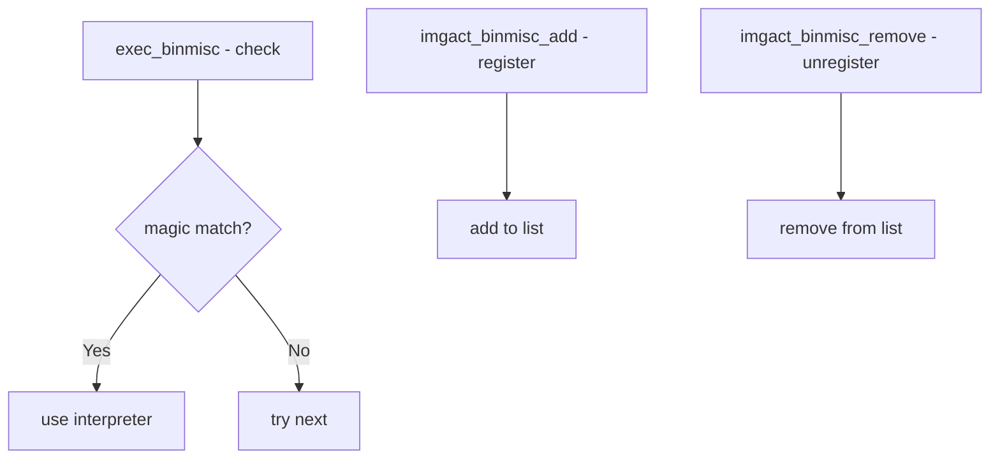

# Component: imgact_binmisc.c

**Path:** `sys/kern/imgact_binmisc.c`
**Type:** File
**Maps to:** `.discovery/sys/kern/imgact_binmisc.md`

## Purpose

Binary interpreter activator (binmisc) - handles shebang (#!) scripts, QEMU userland, and custom binary formats. Allows registering custom image activators for non-standard binary types.

## Structure



## Key Functions

| Function | Purpose | Signature |
|----------|---------|-----------|
| `exec_binmisc` | Check for binmisc | `int exec_binmisc(struct image_params *imgp)` |
| `imgact_binmisc_add` | Register handler | `int imgact_binmisc_add(struct imgact_binmisc_entry *entry)` |
| `imgact_binmisc_remove` | Unregister | `int imgact_binmisc_remove(const char *name)` |
| `imgact_binmisc_list` | List handlers | `int imgact_binmisc_list(struct sbuf *sb)` |

## Binary Interpreter Entry

```c
struct imgact_binmisc_entry {
    const char *xbe_name;     // Name
    const char *xbe_interp;   // Interpreter path
    char *xbe_magic;         // Magic bytes
    size_t xbe_moffset;      // Magic offset
    size_t xbe_msize;        // Magic size
    int xbe_flags;           // Flags
};
```

## Shebang Support

| Shebang | Description |
|---------|-------------|
| `#!/bin/sh` | Shell script |
| `#!/bin/bash` | Bash script |
| `#!/usr/bin/perl` | Perl script |

## Registered Interpreters

| Type | Interpreter |
|------|-------------|
| `linux` | Linux binary |
| `qemu` | QEMU userland |
| `compat` | FreeBSD compat |

## Magic Matching

| Field | Description |
|-------|-------------|
| `xbe_magic` | Magic bytes |
| `xbe_moffset` | Offset in file |
| `xbe_mask` | Mask bits |

## Sysctl

| Node | Description |
|------|-------------|
| `kern.exec.binmisc` | Binmisc handlers |

## Includes

- `sys/imgact_binmisc.h` - Binary misc definitions

## Depends On

- `kern_exec.c` for exec machinery
- `sys/namei.h` for name lookup