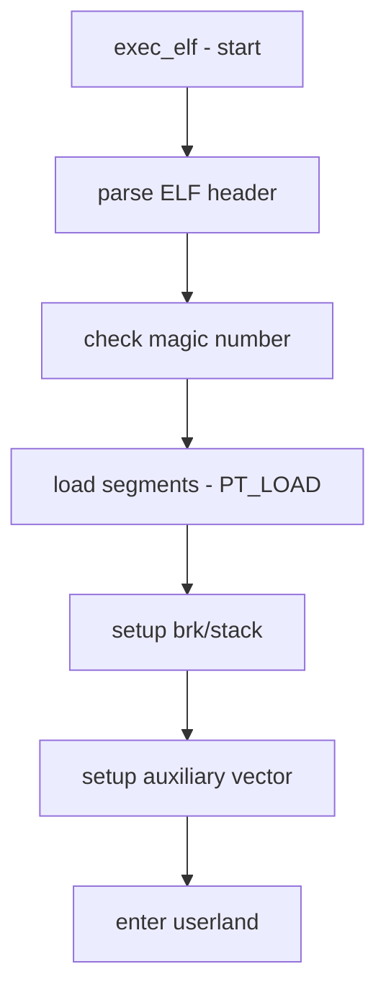

# Component: imgact_elf.c

**Path:** `sys/kern/imgact_elf.c`
**Type:** File
**Maps to:** `.discovery/sys/kern/imgact_elf.md`

## Purpose

ELF image activator - handles loading and execution of ELF (Executable and Linkable Format) binaries. Parses ELF headers, sets up memory segments, and initiates execution.

## Structure

## Key Functions

| Function | Purpose | Signature |
|----------|---------|-----------|
| `exec_elf` | ELF exec handler | `int exec_elf(struct image_params *imgp)` |
| `elf_load_section` | Load section | `static int elf_load_section(...)` |
| `elf_load_file` | Load from file | `static int elf_load_file(...)` |
| `elf_map_jitted` | JIT mapping | `static int elf_map_jitted(...)` |
| `elf_populate_auxargs` | Setup aux vector | `static void elf_populate_auxargs(...)` |

## ELF Structures

| Structure | Purpose |
|-----------|---------|
| `Elf_Ehdr` | ELF header |
| `Elf_Phdr` | Program header |
| `Elf_Shdr` | Section header |
| `Elf_Dyn` | Dynamic section |

## Program Header Types

| Type | Description |
|------|-------------|
| `PT_LOAD` | Loadable segment |
| `PT_DYNAMIC` | Dynamic linking |
| `PT_INTERP` | Interpreter path |
| `PT_NOTE` | Notes |
| `PT_PHDR` | Program header |
| `PT_TLS` | TLS template |

## ELF Classes

| Class | Description |
|-------|-------------|
| `ELFCLASS32` | 32-bit ELF |
| `ELFCLASS64` | 64-bit ELF |

## Includes

- `sys/imgact_elf.h` - ELF image activator
- `sys/exec.h` - Exec definitions
- `sys/elf.h` - ELF structures

## Depends On

- `kern_exec.c` for exec machinery
- `vm/vm_map.c` for memory mapping