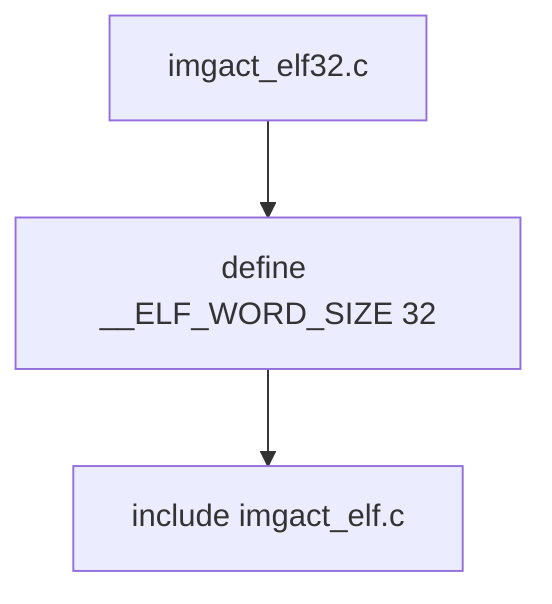

# Component: imgact_elf32.c

**Path:** `sys/kern/imgact_elf32.c`
**Type:** File
**Maps to:** `.discovery/sys/kern/imgact_elf32.md`

## Purpose

32-bit ELF image activator wrapper - thin wrapper that includes imgact_elf.c with `__ELF_WORD_SIZE 32` to compile the 32-bit ELF handler.

## Structure

## Relationship

| File | Description |
|------|-------------|
| `imgact_elf.c` | Main ELF activator |
| `imgact_elf32.c` | 32-bit wrapper |
| `imgact_elf64.c` | 64-bit wrapper |

## ELF Word Size

| Define | Description |
|--------|-------------|
| `__ELF_WORD_SIZE 32` | 32-bit ELF |

## Includes

- `kern/imgact_elf.c` - Shared ELF code

## Depends On

- `imgact_elf.c` for implementation