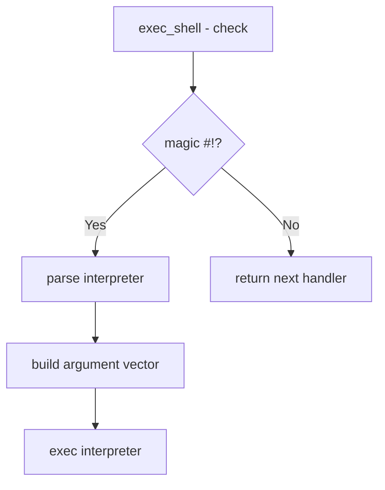

# Component: imgact_shell.c

**Path:** `sys/kern/imgact_shell.c`
**Type:** File
**Maps to:** `.discovery/sys/kern/imgact_shell.md`

## Purpose

Shell script interpreter (shebang) - handles execution of scripts starting with `#!`. Reads the interpreter path from the first line and executes the specified interpreter with the script as argument.

## Structure



## Key Functions

| Function | Purpose | Signature |
|----------|---------|-----------|
| `exec_shell` | Shell exec handler | `int exec_shell(struct image_params *imgp)` |
| `shell_script` | Parse script | `static int shell_script(struct image_params *imgp, ...)` |

## Shebang Format

```
#!/interpreter [arg]
```

| Example | Description |
|---------|-------------|
| `#!/bin/sh` | Shell script |
| `#!/usr/bin/perl` | Perl script |
| `#!/usr/bin/python` | Python script |

## Magic Number

| Value | Description |
|-------|-------------|
| `0x2123` | `#!` (little-endian) |
| `0x2321` | `!#` (big-endian) |

## Limits

| Constant | Description |
|----------|-------------|
| `MAXSHELLCMDLEN` | Max shebang line |
| `MAXINTERP` | Max interpreter path |

## Includes

- `sys/imgact.h` - Image activator
- `sys/systm.h` - System definitions

## Depends On

- `kern_exec.c` for exec machinery
- `imgact_binmisc.c` for interpreter handling