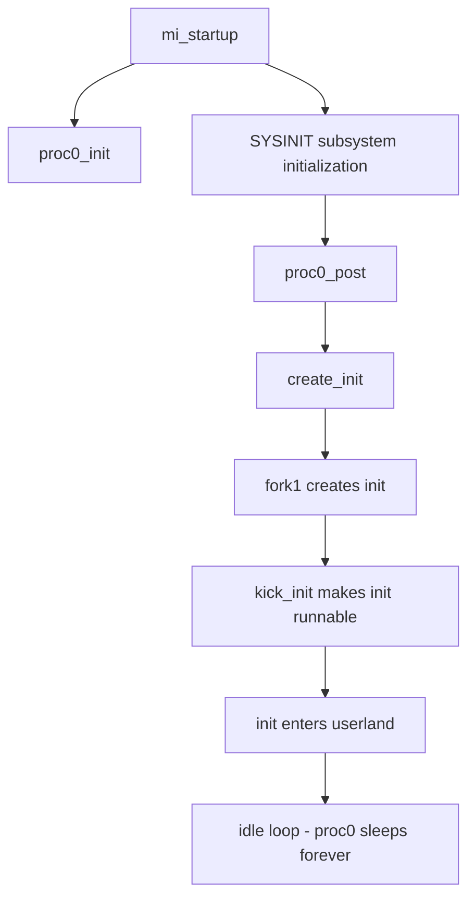
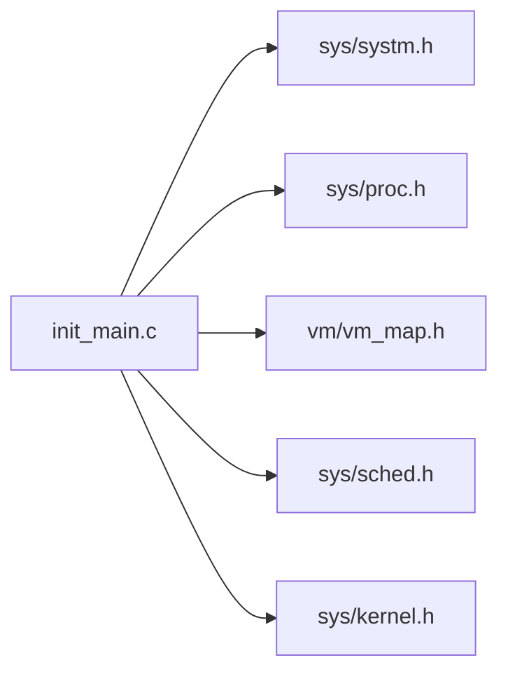

# sys/kern/init_main.c — Main Initialization Codebase Map

**Path:** `sys/kern/init_main.c`
**Purpose:** Kernel initialization and startup

## File Overview

This is the main initialization file for the FreeBSD kernel. It sets up process 0 (proc0), initializes subsystems via SYSINIT, and starts the first user process (init).

## Key Functions

| Function | Purpose | Signature |
|----------|---------|-----------|
| `mi_startup()` | Main startup - calls all SYSINIT functions in order | `void mi_startup(void)` |
| `proc0_init()` | Initialize proc0 structure | `static void proc0_init(void *dummy)` |
| `proc0_post()` | Post-initialization for proc0 | `static void proc0_post(void *dummy)` |
| `start_init()` | Start the init process (PID 1) | `static void start_init(void *dummy)` |
| `create_init()` | Create init process via fork | `static void create_init(const void *udata)` |
| `kick_init()` | Make init runnable | `static void kick_init(const void *udata)` |
| `sysinit_add()` | Add sysinit items dynamically | `void sysinit_add(struct sysinit **set, struct sysinit **set_end)` |

## Data Structures

| Structure | Purpose |
|-----------|---------|
| `proc0` | Process 0 (kernel) - statically allocated |
| `thread0` | Thread 0 - kernel's first thread |
| `vmspace0` | Initial virtual address space |
| `initproc` | Pointer to init process (PID 1) |

## Global Variables

| Variable | Purpose |
|----------|---------|
| `boothowto` | Boot flags from loader |
| `bootverbose` | Verbose boot output control |
| `proc0` | Process 0 structure |
| `initproc` | Init process pointer |

## Boot Flow

## SYSINIT Subsystems

The kernel uses SYSINIT for ordered initialization:

| Subsystem | Order | Purpose |
|-----------|-------|---------|
| SI_SUB_DUMMY | First | Skip placeholder tasks |
| SI_SUB_INTRINSIC | Early | Core kernel structures |
| SI_SUB_CREATE_INIT | Mid | Create init process |
| SI_SUB_KTHREAD_INIT | Late | Kernel threads |
| SI_SUB_LAST | Final | Final cleanup |

## Key Includes

## Depends On

- `sys/proc.h` - Process structures
- `sys/sched.h` - Scheduler
- `vm/vm_map.h` - Virtual memory
- `sys/kernel.h` - Kernel subsystem definitions

## System Initialization Sequence

1. `mi_startup()` builds sorted sysinit list from linker set
2. `proc0_init()` creates proc0, thread0, vmspace0
3. Subsystem SYSINITs run in order (SI_SUB_*)
4. `create_init()` forks init process (PID 1)
5. `start_init()` tries to exec /sbin/init or /rescue/init
6. proc0 enters idle loop forever