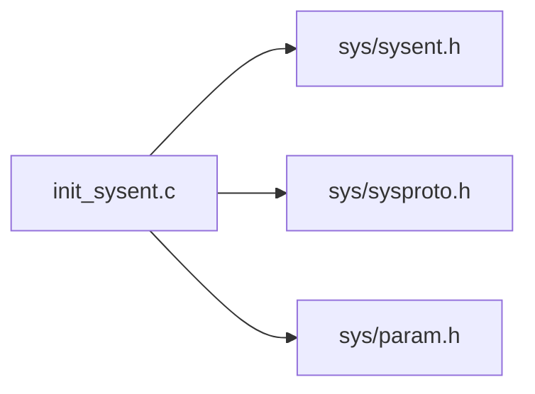

# sys/kern/init_sysent.c — System Call Table Codebase Map

**Path:** `sys/kern/init_sysent.c`
**Purpose:** System call dispatch table (auto-generated)

## File Overview

Contains the `sysent[]` array that maps system call numbers to handler functions. This file is automatically generated - do not edit manually.

## System Call Numbers (0-500+)

| Num | Name | Function | Purpose |
|-----|------|----------|---------|
| 0 | syscall | nosys | Invalid syscall trap |
| 1 | _exit | sys_exit | Terminate process |
| 2 | fork | sys_fork | Create new process |
| 3 | read | sys_read | Read from fd |
| 4 | write | sys_write | Write to fd |
| 5 | open | sys_open | Open file |
| 6 | close | sys_close | Close fd |
| 7 | wait4 | sys_wait4 | Wait for child |
| 8 | creat | sys_open | Create file (legacy) |
| 9 | link | sys_link | Create link |
| 10 | unlink | sys_unlink | Remove link |
| ... | ... | ... | ... |
| 97 | socket | sys_socket | Create socket |
| 98 | connect | sys_connect | Connect socket |
| 104 | bind | sys_bind | Bind socket |
| 105 | setsockopt | sys_setsockopt | Set socket option |
| 106 | listen | sys_listen | Listen on socket |

## Syscall Structure

```c
struct sysent {
    int sy_narg;           // Number of arguments
    sy_call_t *sy_call;    // Function pointer
    au_event_t sy_auevent;  // Audit event
    int sy_flags;
    int sy_thrcnt;          // Thread count
};
```

## Compatibility Macros

| Macro | Purpose |
|-------|---------|
| `compat(n, name)` | 4.4BSD compatibility |
| `compat4(n, name)` | FreeBSD4 compatibility |
| `compat6(n, name)` | FreeBSD6 compatibility |
| `compat7(n, name)` | FreeBSD7 compatibility |
| `compat10(n, name)` | FreeBSD10 compatibility |
| `compat11(n, name)` | FreeBSD11 compatibility |
| `compat12(n, name)` | FreeBSD12 compatibility |
| `compat13(n, name)` | FreeBSD13 compatibility |
| `compat14(n, name)` | FreeBSD14 compatibility |

## Syscall Dispatch Flow

```mermaid
flowchart TD
    A[User calls syscall] --> B[CPU trap to kernel]
    B --> C[syscall() function]
    C --> D[Get syscall number from register]
    D --> E[index into sysent[]]
    E --> F[Call sy_call function]
    F --> G[sys_close returns]
    G --> C[syscall returns to user]
```

## System Call Categories

| Category | Calls |
|----------|-------|
| Process | fork, vfork, rfork, execve, _exit, wait4, etc. |
| File | open, close, read, write, lseek, etc. |
| Socket | socket, connect, bind, listen, accept, etc. |
| Memory | mmap, mprotect, munmap, madvise, etc. |
| IPC | msgget, msgsnd, msgrcv, semget, etc. |
| Time | gettimeofday, settimeofday, clock_gettime, etc. |

## Audit Events (AUE_*)

Each syscall has an associated audit event for BSM audit subsystem.

## Key Includes



## Related Files

| File | Purpose |
|------|---------|
| `syscalls.master` | Master syscall definitions |
| `kern_syscalls.c` | Legacy syscall support |
| `sys_syscall.c` | Syscall wrapper |
| `sys_sysent.c` | Alternative sysent |