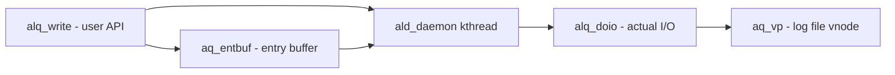

# Component: kern_alq.c

**Path:** `sys/kern/kern_alq.c`
**Type:** File
**Maps to:** `.discovery/sys/kern/kern_alq.md`

## Purpose

Asynchronous Logging Queue (ALQ) - provides high-performance asynchronous logging to disk. Used by audit subsystem and other kernel components requiring ordered, asynchronous write logging.

## Structure

## Key Functions

| Function | Purpose | Signature |
|----------|---------|-----------|
| `alq_write` | Write entry to async log queue | `int alq_write(struct alq *alq, const void *buf, size_t len)` |
| `alq_open` | Open/create an async log queue | `int alq_open(const char *path, struct alq *alq, size_t len)` |
| `alq_close` | Close an async log queue | `void alq_close(struct alq *alq)` |
| `alq_flush` | Flush all pending entries | `int alq_flush(struct alq *alq)` |
| `ald_daemon` | Kernel daemon that performs actual I/O | `static void ald_daemon(void)` |
| `ald_add` | Add queue to global list | `static int ald_add(struct alq *alq)` |
| `ald_activate` | Activate queue for I/O | `static void ald_activate(struct alq *alq)` |

## Data Structures

| Structure | Purpose |
|-----------|---------|
| `struct alq` | Async log queue descriptor |
| `struct ale` | Async log entry descriptor |
| `M_ALD` | MALLOC zone for ALD (Audit Log Daemon) |
| `ald_queues` | Global list of all active queues |
| `ald_active` | List of queues with pending data |

## Queue Flags

| Flag | Meaning |
|------|---------|
| `AQ_WANTED` | Wakeup sleeper when I/O done |
| `AQ_ACTIVE` | On the active list |
| `AQ_FLUSHING` | Currently doing I/O |
| `AQ_SHUTDOWN` | Queue no longer valid |
| `AQ_ORDERED` | Enforces ordered writes |
| `AQ_LEGACY` | Fixed length writes |

## Includes

- `sys/alq.h` - ALQ header
- `sys/eventhandler.h` - Event handling
- `sys/proc.h` - Process structures
- `sys/vnode.h` - Vnode operations

## Depends On

- Used by `security/audit/audit.c` for audit trail logging
- Used by BSM (Basic Security Module) implementation