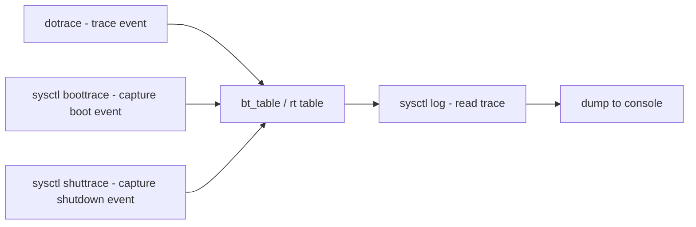

# Component: kern_boottrace.c

**Path:** `sys/kern/kern_boottrace.c`
**Type:** File
**Maps to:** `.discovery/sys/kern/kern_boottrace.md`

## Purpose

Boot-time and shutdown-time tracing facility. Records kernel events during system boot and shutdown for performance analysis and debugging. Provides sysctl interface to capture and read trace data.

## Structure

## Key Functions

| Function | Purpose | Signature |
|----------|---------|-----------|
| `dotrace` | Record a trace event | `void dotrace(int type, const char *name, ...)` |
| `sysctl_log` | Read and log trace entries via sysctl | `static int sysctl_log(SYSCTL_HANDLER_ARGS)` |
| `sysctl_boottrace` | Capture boot-time trace event | `static int sysctl_boottrace(...)` |
| `sysctl_runtrace` | Capture runtime trace event | `static int sysctl_runtrace(...)` |
| `sysctl_shuttrace` | Capture shutdown trace event | `static int sysctl_shuttrace(...)` |
| `sysctl_boottrace_reset` | Reset runtime trace table | `static int sysctl_boottrace_reset(...)` |

## Data Structures

| Structure | Purpose |
|-----------|---------|
| `struct bt_event` | Single trace event (tsc, tick, cputime, cpuid, pid, name) |
| `struct bt_table` | Trace table (size, curr, wrap, drops, table) |
| `bt` | Boot-time trace table |
| `rt` | Run-time trace table |
| `st` | Shutdown-time trace table |

## Trace Tables

| Table | Purpose | Default Size |
|-------|---------|--------------|
| `BT_TABLE_DEFSIZE` | Default table size | 3000 entries |
| `BT_TABLE_RUNSIZE` | Runtime table size | 2000 entries |
| `BT_TABLE_SHTSIZE` | Shutdown table size | 1000 entries |
| `BT_TABLE_MINSIZE` | Minimum table size | 500 entries |

## Sysctl Nodes

- `kern.boottrace.dotrace_kernel` - Enable kernel tracing (default: true)
- `kern.boottrace.dotrace_user` - Enable user tracing (default: true)
- `kern.boottrace.enabled` - Global enable
- `kern.boottrace.shutdown_trace` - Dump shutdown trace to console

## Includes

- `sys/boottrace.h` - Boot trace definitions
- `sys/time.h` - Time structures
- `sys/proc.h` - Process structures
- `sys/sbuf.h` - String buffer

## Depends On

- Called during early kernel initialization
- Used by device drivers and subsystems to record timing data
- `kern_clock.c` for timestamp sources