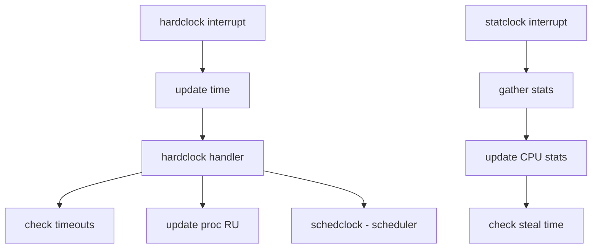

# Component: kern_clock.c

**Path:** `sys/kern/kern_clock.c`
**Type:** File
**Maps to:** `.discovery/sys/kern/kern_clock.md`

## Purpose

Clock/interrupt handling - handles hardclock and statclock interrupts. Updates system time, process statistics, scheduler tick, and drives callout processing.

## Structure

## Key Functions

| Function | Purpose | Signature |
|----------|---------|-----------|
| `hardclock` | Hard clock intr | `void hardclock(void *arg)` |
| `statclock` | Stat clock intr | `void statclock(void *arg)` |
| `hardclock_cpu` | CPU-specific | `void hardclock_cpu(void *arg)` |
| `statclock_cpu` | Per-CPU stats | `void statclock_cpu(void *arg)` |
| `schedclock` | Scheduler tick | `void schedclock(struct thread *td)` |
| `timechange` | Time adjustment | `void timechange(void)` |
| `lc_ticks` | Logical time | `uint64_t lc_ticks(struct lock_class *lc)` |

## Clock Handlers

| Handler | Purpose |
|---------|---------|
| `hardclock` | System time, timeouts |
| `statclock` | Process/CPU statistics |
| `profclock` | Profiling |

## Time Updates

- `tc_tick` - Timecounter tick
- `hardlock` - Updates `time` and `boottime`
- `statclock` - Updates `ru` (resource usage)

## Includes

- `sys/clock.h` - Clock definitions
- `sys/kthread.h` - Kernel threads
- `sys/sched.h` - Scheduler

## Depends On

- `kern_time.c` for timekeeping
- `kern_timeout.c` for callouts