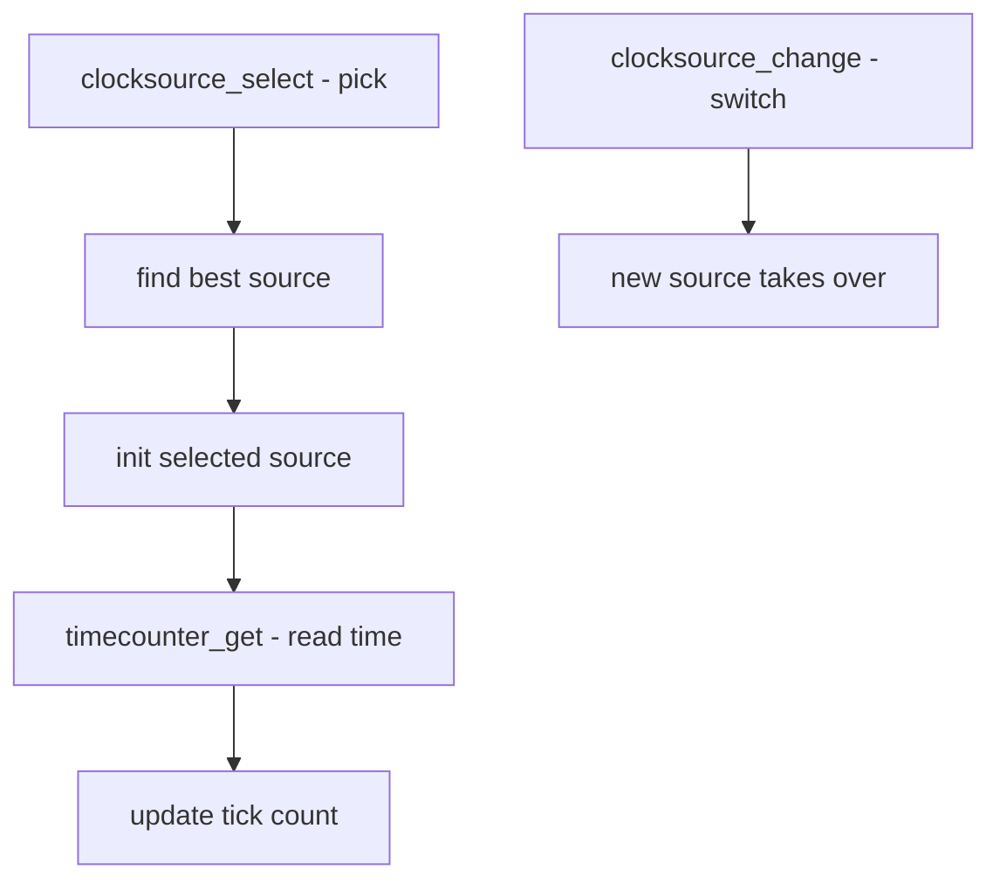

# Component: kern_clocksource.c

**Path:** `sys/kern/kern_clocksource.c`
**Type:** File
**Maps to:** `.discovery/sys/kern/kern_clocksource.md`

## Purpose

Clock source management - manages hardware clock sources for timekeeping. Works with event timers (kern_et.c) to select and use the best available clock source for the system.

## Structure



## Key Functions

| Function | Purpose | Signature |
|----------|---------|-----------|
| `clocksource_select` | Select best source | `void clocksource_select(void)` |
| `clocksource_change` | Switch source | `void clocksource_change(struct timesource *ts, int oldflags)` |
| `timecounter_get` | Get current time | `uint64_t timecounter_get(void)` |
| `tc_init` | Init timecounter | `void tc_init(struct timecounter *tc)` |
| `tc_windup` | Advance time | `void tc_windup(void)` |

## Timecounter Structure

```c
struct timecounter {
    uint64_t (*tc_get_timecount)(struct timecounter *tc);
    void (*tc_poll)(struct timecounter *tc);
    void (*tc_adj_time)(struct timecounter *tc, int diff);
    uint32_t tc_frequency;      // Hz
    const char *tc_name;         // Name
    int tc_quality;             // Quality (higher = better)
    int tc_flags;
    void *tc_priv;              // Private data
};
```

## Clock Sources

| Source | Description |
|--------|-------------|
| `TSC` | Time Stamp Counter |
| `HPET` | High Precision Event Timer |
| `ACPI` | ACPI PM Timer |
| `LAPIC` | Local APIC Timer |

## Timekeeping

| Counter | Description |
|---------|-------------|
| `tick` | System tick count |
| `second` | Seconds since boot |
| `time` | Current time (struct timeval) |

## CPU C-States

| State | Description |
|-------|-------------|
| `C2` | CPU can disable clock |
| `C3` | CPU can stop clock |

## Sysctls

| Node | Description |
|------|-------------|
| `kern.timecounter` | Timecounter settings |

## Includes

- `sys/timetc.h` - Timecounter definitions
- `sys/timeet.h` - Event timer definitions

## Depends On

- `kern_et.c` for event timers
- `machine/clock.h` for MD clock