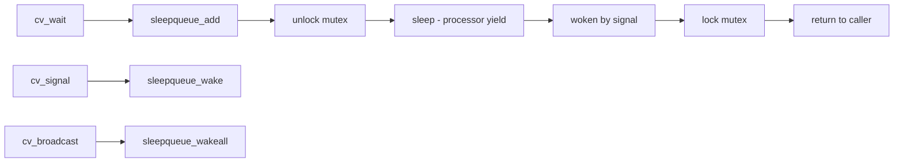

# Component: kern_condvar.c

**Path:** `sys/kern/kern_condvar.c`
**Type:** File
**Maps to:** `.discovery/sys/kern/kern_condvar.md`

## Purpose

Condition variables - implements cv_wait/cv_signal/cv_broadcast for thread synchronization. Allows threads to sleep until a condition becomes true and are woken by other threads.

## Structure



## Key Functions

| Function | Purpose | Signature |
|----------|---------|-----------|
| `cv_init` | Initialize CV | `void cv_init(struct cv *cv, const char *desc)` |
| `cv_destroy` | Destroy CV | `void cv_destroy(struct cv *cv)` |
| `cv_wait` | Wait for condition | `void cv_wait(struct cv *cv, struct mtx *mp)` |
| `cv_wait_sbt` | Wait with timeout | `int cv_wait_sbt(struct cv *cv, struct mtx *mp, ...)` |
| `cv_waitUntil` | Wait with absolute | `int cv_waitUntil(struct cv *cv, struct mtx *mp, sbintime_t sbt)` |
| `cv_signal` | Wake one waiter | `void cv_signal(struct cv *cv)` |
| `cv_broadcast` | Wake all waiters | `void cv_broadcast(struct cv *cv)` |
| `cv_has_waiters` | Check waiters | `int cv_has_waiters(struct cv *cv)` |

## Condition Variable Structure

```c
struct cv {
    struct sleepqueue *cv_waiters;  // Sleep queue
    const char *cv_description;       // Description
};
```

## cv_wait Flags

| Flag | Description |
|------|-------------|
| `PZERO` | Priority |
| `PCATCH` | Signal catch |
| `PDROP` | Drop lock on sleep |

## Includes

- `sys/condvar.h` - CV definitions
- `sys/mutex.h` - Mutex for pairing
- `sys/sleepq.h` - Sleep queue

## Depends On

- `kern_mutex.c` for mutex pairing
- `kern_synch.c` for sleep/wakeup