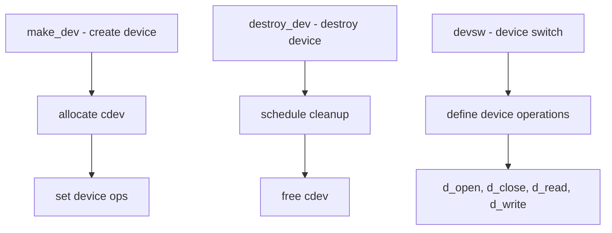

# Component: kern_conf.c

**Path:** `sys/kern/kern_conf.c`
**Type:** File
**Maps to:** `.discovery/sys/kern/kern_conf.md`

## Purpose

Device management - implements device registration, device switching, and device node creation/destruction (make_dev/destroy_dev). Core of FreeBSD device infrastructure.

## Structure

## Key Functions

| Function | Purpose | Signature |
|----------|---------|-----------|
| `make_dev` | Create device node | `struct cdev *make_dev(struct cdevsw *devsw, int unit, uid_t uid, gid_t gid, int mode, const char *name)` |
| `make_dev_cred` | Create with credentials | `struct cdev *make_dev_cred(...)` |
| `destroy_dev` | Destroy device | `void destroy_dev(struct cdev *dev)` |
| `destroy_dev_sched` | Schedule destroy | `void destroy_dev_sched(struct cdev *dev)` |
| `devsw` | Device switch lookup | `struct cdevsw *devsw(struct cdev *dev)` |
| `dev_ref` | Reference device | `void dev_ref(struct cdev *dev)` |
| `dev_rel` | Release device ref | `void dev_rel(struct cdev *dev)` |

## Device Switch (cdevsw)

| Operation | Description |
|-----------|-------------|
| `d_open` | Open device |
| `d_close` | Close device |
| `d_read` | Read from device |
| `d_write` | Write to device |
| `d_ioctl` | Device control |
| `d_poll` | Poll for events |
| `d_mmap` | Memory map |
| `d_strategy` | Block strategy |

## Device Types

| Type | Description |
|------|-------------|
| `D_TTY` | TTY device |
| `D_DISK` | Disk device |
| `D_MEM` | Memory device |
| `D_NUL` | Null device |
| `D_TUN` | Tunnel device |

## Includes

- `sys/conf.h` - Device switch definitions
- `sys/device.h` - Device definitions
- `fs/devfs/devfs_int.h` - Devfs internals

## Depends On

- Used by all device drivers
- `fs/devfs/devfs.c` for device file system