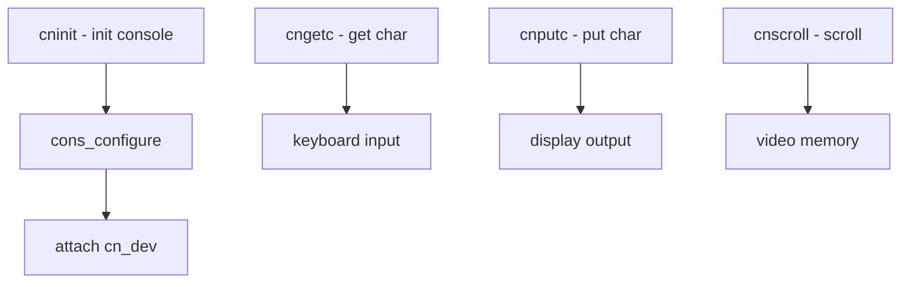

# Component: kern_cons.c

**Path:** `sys/kern/kern_cons.c`
**Type:** File
**Maps to:** `.discovery/sys/kern/kern_cons.md`

## Purpose

Console subsystem - manages system console input/output. Handles console initialization, keyboard input, display output, and console switching (Alt-F1-Fn).

## Structure



## Key Functions

| Function | Purpose | Signature |
|----------|---------|-----------|
| `cninit` | Initialize console | `void cninit(void)` |
| `cnconfigure` | Configure console | `void cnconfigure(void)` |
| `cnunconfigure` | Unconfigure | `void cnunconfigure(void)` |
| `cngetc` | Get character | `int cngetc(struct tty *tp)` |
| `cnputc` | Put character | `void cnputc(int c)` |
| `cnprintf` | Formatted output | `int cnprintf(const char *fmt, ...)` |
| `cnflush` | Flush output | `void cnflush(void)` |
| `cnscroll` | Scroll display | `void cnscroll(int lines)` |

## Console Devices

| Device | Description |
|--------|-------------|
| `/dev/console` | System console |
| `/dev/tty` | Current tty |
| `syscons` | System console driver |
| `vidcontrol` | Console control |

## Console Input

| Source | Description |
|--------|-------------|
| `keyboard` | PS/2 or USB keyboard |
| `serial` | Serial console |
| `netcons` | Network console |

## cn_dev Structure

```c
struct cdevsw {
    int d_version;           // Version
    const char *d_name;       // Name
    // ... device switch
};
```

## Includes

- `sys/cons.h` - Console definitions
- `sys/tty.h` - TTY definitions
- `sys/kbio.h` - Keyboard I/O

## Depends On

- `tty.c` for TTY infrastructure
- `syscons` driver for video