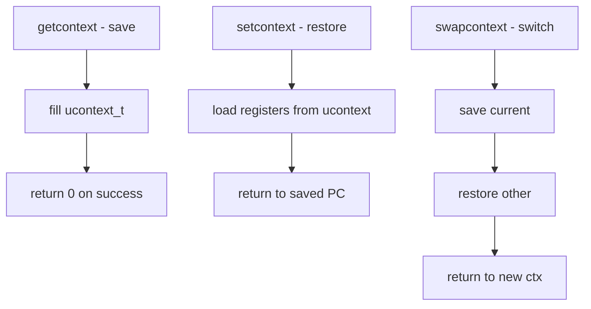

# Component: kern_context.c

**Path:** `sys/kern/kern_context.c`
**Type:** File
**Maps to:** `.discovery/sys/kern/kern_context.md`

## Purpose

User context management - implements getcontext, setcontext, and swapcontext system calls. Allows saving and restoring CPU registers and stack for user-level context switching (makecontext/swapcontext).

## Structure



## Key Functions

| Function | Purpose | Signature |
|----------|---------|-----------|
| `getcontext` | Save current context | `int getcontext(struct __ucontext *ucp)` |
| `setcontext` | Restore context | `int setcontext(const struct __ucontext *ucp)` |
| `swapcontext` | Switch contexts | `int swapcontext(struct __ucontext *oucp, const struct __ucontext *ucp)` |

## ucontext Structure

```c
struct __ucontext {
    sigset_t uc_sigmask;       // Signal mask
    stack_t uc_stack;          // Stack info
    mcontext_t uc_mcontext;     // Machine context (registers)
    struct __ucontext *uc_link; // Continuation context
    // ...
};
```

## Context Components

| Component | Description |
|-----------|-------------|
| `uc_mcontext` | General registers, PC, SP |
| `uc_stack` | Signal stack |
| `uc_sigmask` | Blocked signals |
| `uc_link` | Resume here on exit |

## Usage

```c
// Save context
getcontext(&ctx);

// Modify and swap
makecontext(&ctx, fn, args...);
swapcontext(&old, &ctx);
```

## Includes

- `sys/ucontext.h` - ucontext definitions
- `sys/signalvar.h` - Signal variables

## Depends On

- `machine/context.h` for MD context
- `sys/signal.h` for signal handling