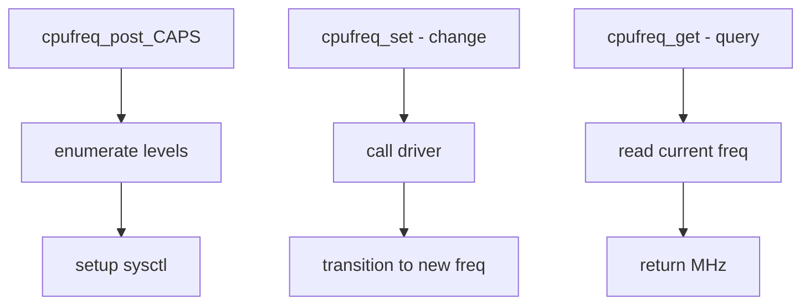

# Component: kern_cpu.c

**Path:** `sys/kern/kern_cpu.c`
**Type:** File
**Maps to:** `.discovery/sys/kern/kern_cpu.md`

## Purpose

CPU frequency management (cpufreq) - manages CPU frequency scaling and voltage control. Provides interface for CPU frequency drivers to expose frequency levels and allows userland to query/set CPU speeds.

## Structure



## Key Functions

| Function | Purpose | Signature |
|----------|---------|-----------|
| `cpufreq_post_CAPS` | Post-detect init | `void cpufreq_post_CAPS(void)` |
| `cpufreq_set` | Set frequency | `int cpufreq_set(int freq)` |
| `cpufreq_get` | Get frequency | `int cpufreq_get(void)` |
| `cpufreq_levels` | List levels | `int cpufreq_levels(device_t dev, int *nlevels, struct cf_level **levels)` |
| `cpufreq_by_info` | Find by device | `int cpufreq_by_info(device_t dev, int *freq)` |

## CPU Frequency Components

| Component | Description |
|-----------|-------------|
| `cf_level` | Frequency/voltage level |
| `cpufreq_softc` | Driver private data |

## cf_level Structure

```c
struct cf_level {
    int freq;           // Frequency in MHz
    int volts;          // Voltage in mV
    // ...
};
```

## P-States

| State | Description |
|-------|-------------|
| `P0` | Maximum performance |
| `P1` | Performance throttled |
| `Pn` | Lower states |

## Sysctl

| Node | Description |
|------|-------------|
| `dev.cpu.*.freq` | Current frequency |
| `dev.cpu.*.freq_levels` | Available levels |

## cpufreq Driver Interface

| Method | Description |
|--------|-------------|
| `CPUFREQ_DRV_SET` | Set frequency |
| `CPUFREQ_DRV_GET` | Get current freq |

## Includes

- `sys/cpu.h` - CPU definitions
- `dev/cpufreq/cpufreq_if.h` - Interface

## Depends On

- `device/cpufreq` for drivers
- `sys/power.h` for power management