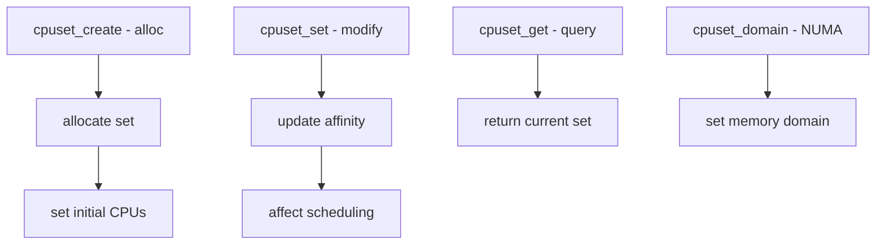

# Component: kern_cpuset.c

**Path:** `sys/kern/kern_cpuset.c`
**Type:** File
**Maps to:** `.discovery/sys/kern/kern_cpuset.md`

## Purpose

CPU affinity sets (cpuset) - manages CPU affinity for processes and threads. Provides system calls to create, modify, and query CPU sets for binding threads to specific CPUs.

## Structure



## Key Functions

| Function | Purpose | Signature |
|----------|---------|-----------|
| `cpuset_create` | Create cpuset | `struct cpuset *cpuset_create(void)` |
| `cpuset_set` | Set affinity | `int cpuset_set(pid_t pid, ...)` |
| `cpuset_get` | Get affinity | `int cpuset_get(pid_t pid, ...)` |
| `cpuset_affinity` | Apply affinity | `int cpuset_affinity(domainset_t, ...)` |
| `cpuset_delref` | Release ref | `void cpuset_delref(struct cpuset *cs)` |

## Cpuset Syscalls

| Call | Description |
|------|-------------|
| `cpuset_setid` | Set thread affinity |
| `cpuset_getid` | Get affinity |
| `cpuset_getaffinity` | Get CPU mask |
| `cpuset_setaffinity` | Set CPU mask |
| `cpuset_getdomain` | Get NUMA domain |
| `cpuset_setdomain` | Set NUMA domain |

## CPU Set Structure

```c
struct cpuset {
    u_int cs_id;           // Set ID
    int cs_refcount;       // Reference count
    struct domainset *cs_domain;  // NUMA domains
    cpuset_t cs_mask;     // CPU bitmask
    // ...
};
```

## CPU Masks

| Mask | Description |
|------|-------------|
| `CPUSET_SYS` | All CPUs |
| `CPUSETET_FFCS` | Root set |

## Domain Sets (NUMA)

| Type | Description |
|------|-------------|
| `DOMAINSET_POLICY_DEFAULT` | Default policy |
| `DOMAINSET_POLICY_FIRST` | First available |
| `DOMAINSET_POLICY_ROUNDROBIN` | Round robin |

## Includes

- `sys/cpuset.h` - Cpuset definitions
- `sys/domainset.h` - NUMA domain sets

## Depends On

- `kern_sched.c` for scheduler
- `sys/capsicum.h` for capability mode