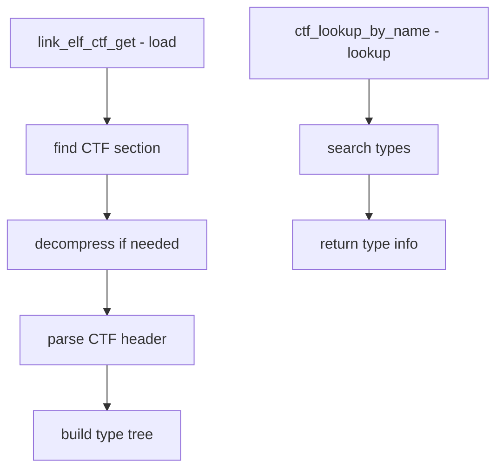

# Component: kern_ctf.c

**Path:** `sys/kern/kern_ctf.c`
**Type:** File
**Maps to:** `.discovery/sys/kern/kern_ctf.md`

## Purpose

CTF (Common Type Format) - provides access to embedded type information in kernel modules. CTF is a compact debugging format that stores C type information without full debug info.

## Structure



## Key Functions

| Function | Purpose | Signature |
|----------|---------|-----------|
| `link_elf_ctf_get` | Get CTF from file | `int link_elf_ctf_get(linker_file_t lf, linker_ctf_t *lc)` |
| `ctf_open` | Open CTF data | `int ctf_open(const char *name, ...)` |
| `ctf_close` | Close CTF | `void ctf_close(void *vfp)` |
| `ctf_lookup_by_name` | Find type | `ctf_id_t ctf_lookup_by_name(...)` |
| `ctf_type_name` | Get type name | `const char *ctf_type_name(...)` |

## CTF Structure

```c
struct ctf_header {
    u_char cth_version;      // Version
    u_char cth_flags;       // Flags
    u_int cth_parlabel;     // Parent label
    u_int cth_parname;      // Parent name
    u_int cth_cuname;       // Compile unit name
    // ...
};
```

## CTF Types

| Kind | Description |
|------|-------------|
| `CTF_K_INTEGER` | Integer |
| `CTF_K_FLOAT` | Floating point |
| `CTF_K_POINTER` | Pointer |
| `CTF_K_ARRAY` | Array |
| `CTF_K_STRUCT` | Struct |
| `CTF_K_UNION` | Union |
| `CTF_K_ENUM` | Enum |
| `CTF_K_TYPEDEF` | Typedef |
| `CTF_K_FUNCTION` | Function |

## CTF Uses

| Use | Description |
|-----|-------------|
| `DDB` | Debugger type display |
| `KTDR` | Kernel trace |

## Includes

- `sys/ctf.h` - CTF definitions
- `ddb/db_ctf.h` - DDB CTF interface

## Depends On

- `kern_linker.c` for module loading
- `sys/elf.h` for ELF structures