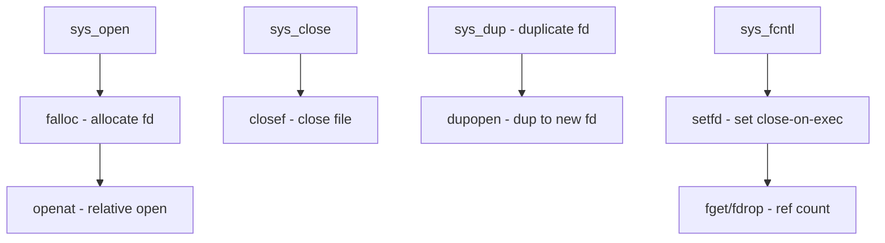

# Component: kern_descrip.c

**Path:** `sys/kern/kern_descrip.c`
**Type:** File
**Maps to:** `.discovery/sys/kern/kern_descrip.md`

## Purpose

File descriptor management - handles open, close, dup, fcntl, and other file descriptor operations. Manages the per-process file descriptor table.

## Structure

## Key Functions

| Function | Purpose | Signature |
|----------|---------|-----------|
| `sys_open` | Open file | `int sys_open(struct thread *td, struct open_args *uap)` |
| `sys_close` | Close file descriptor | `int sys_close(struct thread *td, struct close_args *uap)` |
| `sys_dup` | Duplicate fd | `int sys_dup(struct thread *td, struct dup_args *uap)` |
| `sys_dup2` | Duplicate to specific | `int sys_dup2(struct thread *td, struct dup2_args *uap)` |
| `sys_fcntl` | File control | `int sys_fcntl(struct thread *td, struct fcntl_args *uap)` |
| `sys_flock` | File locking | `int sys_flock(struct thread *td, struct flock_args *uap)` |
| `sys_fstat` | Get file status | `int sys_fstat(struct thread *td, struct fstat_args *uap)` |
| `sys_fadvise` | File advice | `int sys_fadvise(struct thread *td, struct fadvise_args *uap)` |
| `falloc` | Allocate file descriptor | `int falloc(struct thread *td, struct file **fp, int *fd)` |
| `closef` | Close file | `int closef(struct file *fp, struct thread *td)` |
| `fget` | Get file from fd | `struct file *fget(struct thread *td, int fd)` |
| `fdrop` | Release file ref | `void fdrop(struct file *fp, struct thread *td)` |

## File Descriptor Flags

| Flag | Description |
|------|-------------|
| `FD_CLOEXEC` | Close on exec |

## O Flags (open)

| Flag | Description |
|------|-------------|
| `O_RDONLY` | Read only |
| `O_WRONLY` | Write only |
| `O_RDWR` | Read/Write |
| `O_CREAT` | Create file |
| `O_EXCL` | Exclusive open |
| `O_TRUNC` | Truncate |
| `O_APPEND` | Append mode |

## Includes

- `sys/filedesc.h` - File descriptor structures
- `sys/file.h` - File operations
- `sys/fcntl.h` - File control

## Depends On

- `kern_vfs.c` for VFS operations
- `fs/devfs/devfs.c` for device files
- `vfs_syscalls.c` for vnode operations