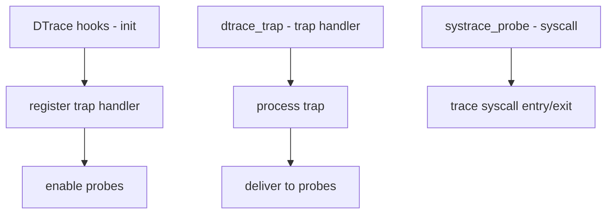

# Component: kern_dtrace.c

**Path:** `sys/kern/kern_dtrace.c`
**Type:** File
**Maps to:** `.discovery/sys/kern/kern_dtrace.md`

## Purpose

DTrace kernel hooks - provides kernel-side support for DTrace dynamic tracing. Implements trap handlers, probe callbacks, and syscall tracing hooks.

## Structure

## Key Hooks

| Hook | Purpose | Signature |
|------|---------|-----------|
| `dtrace_trap_func` | Trap handler | `dtrace_trap_func_t` |
| `dtrace_doubletrap_func` | Double trap | `dtrace_doubletrap_func_t` |
| `dtrace_pid_probe_ptr` | PID provider | `dtrace_pid_probe_ptr_t` |
| `systrace_probe_func` | Syscall probe | `systrace_probe_func_t` |

## DTrace Providers

| Provider | Description |
|----------|-------------|
| `pid` | Process ID tracing |
| `syscall` | Syscall tracing |
| `fbt` | Function boundary |

## Trap Handling

| Function | Description |
|----------|-------------|
| `dtrace_trap` | Handle traps for DTrace |
| `dtrace_double_trap` | Handle double traps |

## systrace (Syscall Tracing)

| Probe | Description |
|-------|-------------|
| `entry` | Syscall entry |
| `return` | Syscall return |

## DTrace Flags

| Flag | Description |
|------|-------------|
| `systrace_enabled` | Syscall tracing on/off |

## Includes

- `sys/dtrace_bsd.h` - BSD DTrace definitions

## Depends On

- `kern_sysent.c` for syscall hooks
- `machine/trap.h` for trap handling