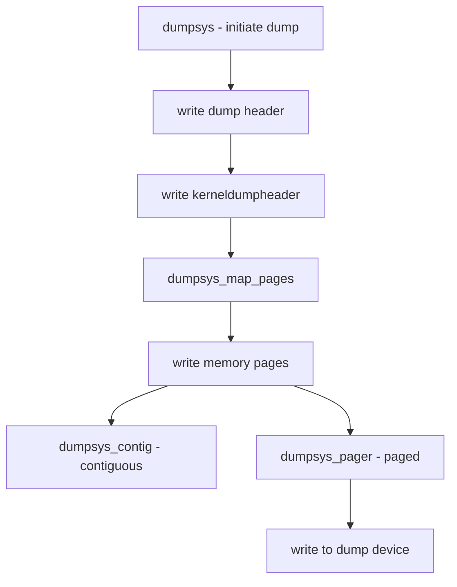

# Component: kern_dump.c

**Path:** `sys/kern/kern_dump.c`
**Type:** File
**Maps to:** `.discovery/sys/kern/kern_dump.md`

## Purpose

Kernel crash dump - handles kernel core dumps for crash analysis. Writes kernel memory image to disk or dump device for post-mortem debugging.

## Structure

## Key Functions

| Function | Purpose | Signature |
|----------|---------|-----------|
| `dumpsys` | Main dump entry | `void dumpsys(void)` |
| `dumpsys_map_pages` | Map pages for dump | `static int dumpsys_map_pages(...)` |
| `dumpsys_pager` | Dump via pager | `static int dumpsys_pager(...)` |
| `dump_init` | Initialize dump | `int dump_init(void)` |
| `dump_write` | Write dump | `int dump_write(void *buf, size_t len)` |
| `kdump_segmap` | Segment map | `static int kdump_segmap(...)` |

## Dump Header

| Field | Description |
|-------|-------------|
| `Architecture` | CPU architecture |
| `Version` | Dump format version |
| `Architecture Size` | 32 or 64 bit |
| `Dump Length` | Total dump size |

## Dump Configuration

| Setting | Description |
|---------|-------------|
| `dumpdev` | Dump device |
| `dumpsize` | Maximum dump size |
| `dumpflags` | Dump options |

## Architecture Support

| Arch | Header | Notes |
|------|--------|-------|
| `amd64` | `struct kerneldumpheader` | 512-byte header |
| `i386` | Same | 32-bit x86 |
| `arm64` | Same | 64-bit ARM |

## Includes

- `sys/kerneldump.h` - Dump definitions
- `vm/vm_dumpset.h` - Dump page set
- `machine/dump.h` - MD dump

## Depends On

- `kern_shutdown.c` for panic handling
- `dev/dumpdev.c` for dump device