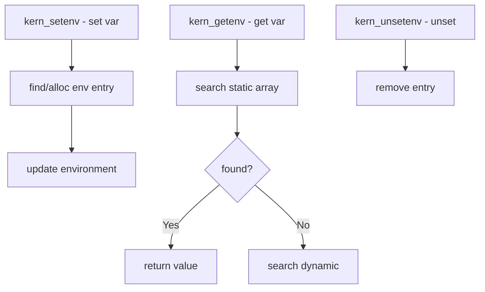

# Component: kern_environment.c

**Path:** `sys/kern/kern_environment.c`
**Type:** File
**Maps to:** `.discovery/sys/kern/kern_environment.md`

## Purpose

Kernel environment - manages boot environment variables (kenv). Handles getting, setting, and unsetting environment variables passed from the bootloader. Available via kenv(2) syscall.

## Structure

## Key Functions

| Function | Purpose | Signature |
|----------|---------|-----------|
| `kern_setenv` | Set env variable | `int kern_setenv(const char *name, const char *value)` |
| `kern_getenv` | Get env variable | `char *kern_getenv(const char *name)` |
| `kern_unsetenv` | Unset variable | `int kern_unsetenv(const char *name)` |
| `freeenv` | Free env value | `void freeenv(char *env)` |
| `getenv` | User get env | `int getenv(const char *name, char *value, size_t len)` |
| `setenv` | User set env | `int setenv(const char *name, const char *value, int overwrite)` |
| `unsetenv` | User unset env | `int unsetenv(const char *name)` |

## Environment Types

| Type | Description |
|------|-------------|
| `static` | Static array (early boot) |
| `dynamic` | Dynamic array (after VM up) |

## Environment Variables

| Variable | Description |
|----------|-------------|
| `kernel` | Kernel name |
| `bootfile` | Boot file |
| `bootargs` | Boot arguments |
| `currdev` | Current device |
| `loaddev` | Load device |

## kenv Syscall

| Call | Description |
|------|-------------|
| `KENV_GET` | Get variable |
| `KENV_SET` | Set variable |
| `KENV_UNSET` | Unset variable |
| `KENV_DUMP` | Dump all vars |

## Includes

- `sys/kenv.h` - Kernel environment
- `security/mac/mac_framework.h` - MAC framework

## Depends On

- `kern_subr.c` for utility functions
- `vm/uma.h` for memory allocation