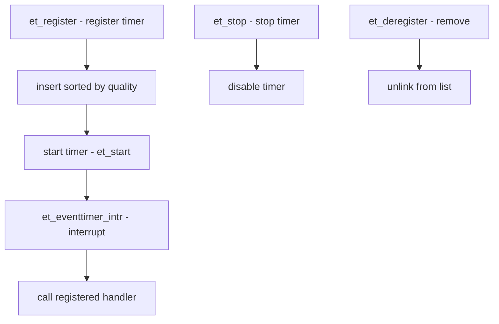

# Component: kern_et.c

**Path:** `sys/kern/kern_et.c`
**Type:** File
**Maps to:** `.discovery/sys/kern/kern_et.md`

## Purpose

Event timer subsystem - manages hardware event timers (TSC, HPET, LAPIC). Registers event timers, handles timer interrupts, provides timekeeping for the kernel.

## Structure



## Key Functions

| Function | Purpose | Signature |
|----------|---------|-----------|
| `et_register` | Register timer | `int et_register(struct eventtimer *et)` |
| `et_deregister` | Unregister timer | `void et_deregister(struct eventtimer *et)` |
| `et_start` | Start timer | `int et_start(struct eventtimer *et, ...)` |
| `et_stop` | Stop timer | `int et_stop(struct eventtimer *et)` |
| `et_eventtimer_intr` | Timer interrupt | `void et_eventtimer_intr(void *arg)` |

## Eventtimer Structure

```c
struct eventtimer {
    char *et_name;           // Timer name
    int et_quality;          // Quality ranking (-1 = don't use)
    uint64_t et_frequency;   // Tick frequency
    int (*et_start)(...);    // Start function
    int (*et_stop)(...);     // Stop function
    void *et_arg;            // Argument
    // ...
};
```

## Timer Types

| Type | Description |
|------|-------------|
| `TSC` | Time Stamp Counter |
| `HPET` | High Precision Event Timer |
| `LAPIC` | Local APIC timer |
| `ACPI` | ACPI PM timer |

## Quality Ranking

| Quality | Description |
|---------|-------------|
| `-1` | Don't use (manual) |
| `0` | Low quality |
| `100+` | High quality |

## Sysctls

| OID | Description |
|-----|-------------|
| `kern.eventtimer.et` | Event timer settings |

## Includes

- `sys/timeet.h` - Event timer definitions

## Depends On

- `kern_clocksource.c` for clock sources
- `sys/sysctl.h` for sysctl interface