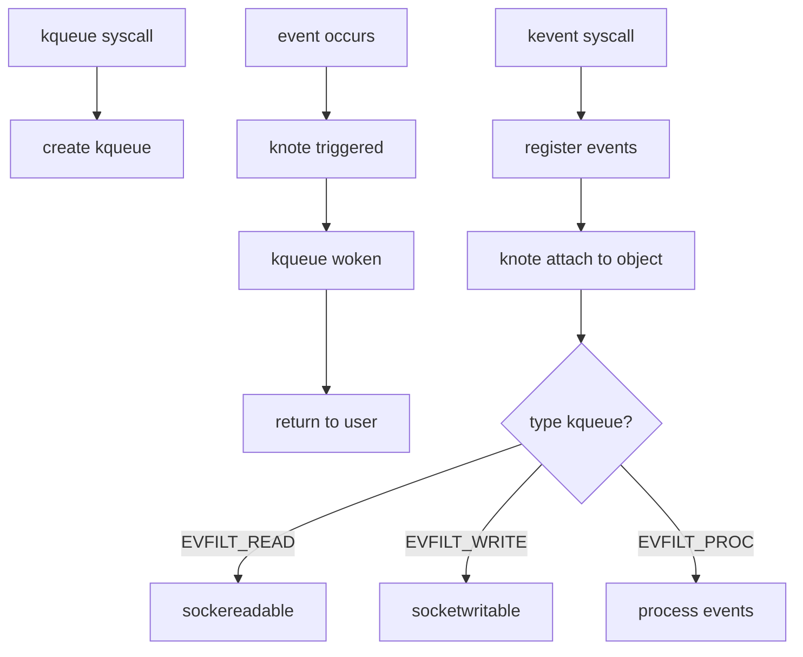

# Component: kern_event.c

**Path:** `sys/kern/kern_event.c`
**Type:** File
**Maps to:** `.discovery/sys/kern/kern_event.md`

## Purpose

Kqueue/eventpoll subsystem - implements kevent(2) system call for scalable event notification. Provides kqueue mechanism for monitoring file descriptors, processes, signals, and timers.

## Structure

## Key Functions

| Function | Purpose | Signature |
|----------|---------|-----------|
| `sys_kqueue` | Create kqueue | `int sys_kqueue(struct thread *td)` |
| `sys_kevent` | Register/wait events | `int sys_kevent(struct thread *td, struct kevent_args *uap)` |
| `kqueue_expand` | Expand kqueue | `int kqueue_expand(struct kqueue *kq)` |
| `kqueue_add` | Add event | `int kqueue_add(struct kqueue *kq, struct kevent *kev)` |
| `kqueue_del` | Delete event | `int kqueue_del(struct kqueue *kq, struct kevent *kev)` |
| `kqueue_scan` | Scan for events | `int kqueue_scan(struct kqueue *kq, int maxevents, ...)` |
| `knote` | Notify kqueue | `void knote(struct knlist *list, long hint)` |
| `knote_fdclose` | Handle fd close | `void knote_fdclose(struct thread *td, int fd)` |

## Filter Types

| Filter | Description |
|--------|-------------|
| `EVFILT_READ` | Readability |
| `EVFILT_WRITE` | Writability |
| `EVFILT_AIO` | AIO complete |
| `EVFILT_VNODE` | Vnode events |
| `EVFILT_PROC` | Process events |
| `EVFILT_SIGNAL` | Signal |
| `EVFILT_TIMER` | Timer |
| `EVFILT_USER` | User-defined |

## Event Flags

| Flag | Description |
|------|-------------|
| `EV_ADD` | Add event |
| `EV_DELETE` | Delete event |
| `EV_ENABLE` | Enable event |
| `EV_DISABLE` | Disable event |
| `EV_ONESHOT` | One-shot |
| `EV_CLEAR` | Clear after report |
| `EV_ERROR` | Error occurred |

## Includes

- `sys/event.h` - Event definitions
- `sys/eventvar.h` - Event variables
- `sys/filio.h` - File I/O

## Depends On

- `kern_descrip.c` for file descriptors
- `kern_kthread.c` for process events
- `kern_time.c` for timer events