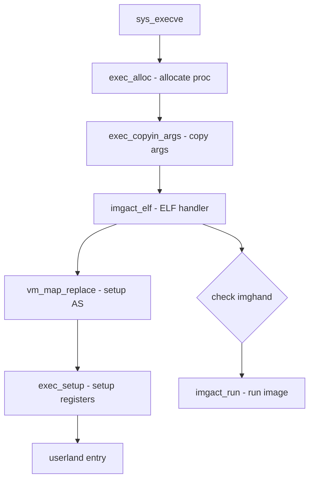

# Component: kern_exec.c

**Path:** `sys/kern/kern_exec.c`
**Type:** File
**Maps to:** `.discovery/sys/kern/kern_exec.md`

## Purpose

Program execution - handles execve() system call and image activation. Loads executable formats (ELF, a.out), sets up address space, and initiates new program execution.

## Structure



## Key Functions

| Function | Purpose | Signature |
|----------|---------|-----------|
| `sys_execve` | Exec syscall | `int sys_execve(struct thread *td, struct execve_args *uap)` |
| `exec_alloc` | Allocate for exec | `int exec_alloc(struct thread *td, struct image_params *imgp)` |
| `exec_free` | Free after exec | `void exec_free(struct image_params *imgp)` |
| `exec_copyin_args` | Copy in arguments | `int exec_copyin_args(struct image_params *imgp, ...)` |
| `exec_setup` | Setup after load | `int exec_setup(struct image_params *imgp, struct thread *td)` |
| `exec_shell` | Execute shell | `int exec_shell(struct image_params *imgp, ...)` |
| `kern_execve` | Core exec | `int kern_execve(struct thread *td, ...)` |

## Image Activators

| Function | Format | Description |
|----------|--------|-------------|
| `imgact_elf` | ELF | Executable/Linkable Format |
| `imgact_aout` | a.out | Legacy format |
| `imgact_shell` | Script | Shell script |
| `imgact_elf32` | ELF32 | 32-bit ELF |

## Image Params

```c
struct image_params {
    const char *ip_vap;      // Argv
    const char *ip_envp;      // Environment
    struct vnode *ip_vp;     // Vnode of file
    struct vattr *ip_attr;   // File attributes
    off_t ip_offset;         // Offset in file
    // ... more fields
};
```

## Includes

- `sys/exec.h` - Exec definitions
- `sys/imgact.h` - Image activators
- `sys/imgact_elf.h` - ELF handling

## Depends On

- `kern_fork.c` for process creation
- `vm/vm_map.c` for address space
- `imgact_elf.c` for ELF loading