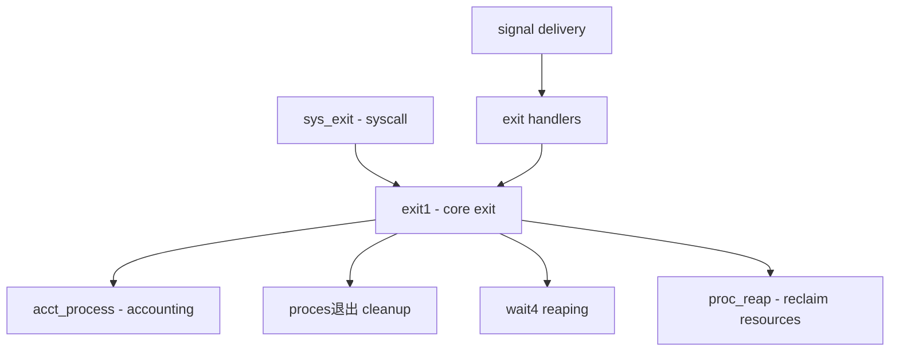

# Component: kern_exit.c

**Path:** `sys/kern/kern_exit.c`
**Type:** File
**Maps to:** `.discovery/sys/kern/kern_exit.md`

## Purpose

Process termination - handles the exit() system call, process cleanup, and resource reclamation. Manages death of a process including signal handling, resource accounting, and orphaned child process reaping.

## Structure

## Key Functions

| Function | Purpose | Signature |
|----------|---------|-----------|
| `sys_exit` | Exit syscall - schedule process death | `int sys_exit(struct thread *td, struct exit_args *uap)` |
| `exit1` | Core exit processing | `void exit1(struct thread *td, int rv)` |
| `exit2` | Final cleanup and resource release | `void exit2(struct proc *p)` |
| `exit_free` | Free process structure | `void exit_free(struct proc *p)` |
| `kern_kill` | Send signal to process | `int kern_kill(struct thread *td, pid_t pid, int signum)` |
| `wait4` | Wait for child process | `int wait4(struct thread *td, struct wait4_args *uap)` |
| `wait6` | Extended wait with options | `int wait6(...)` |
| `proc_dtor` | Process destructor | `void proc_dtor(struct proc *p)` |
| `proc_reap` | Reap orphaned children | `int proc_reap(struct proc *p, struct proc **subchild, int options)` |

## Signal-Related

| Function | Purpose |
|----------|---------|
| `sigexit` | Exit with signal death |
| `coredump` | Generate core dump |
| `killsig` | Send kill signal |

## Includes

- `sys/proc.h` - Process structures
- `sys/signalvar.h` - Signal handling
- `sys/acct.h` - Accounting (acct_process)
- `sys/resourcevar.h` - Resource usage
- `sys/wait.h` - Wait/signal definitions
- `vm/vm_map.h` - Virtual memory cleanup

## Depends On

- Called by `sys_fork.c` for child process handling
- `kern_sigaction.c` for signal delivery
- `kern_acct.c` for accounting integration
- `vm/vm_map.c` for memory cleanup