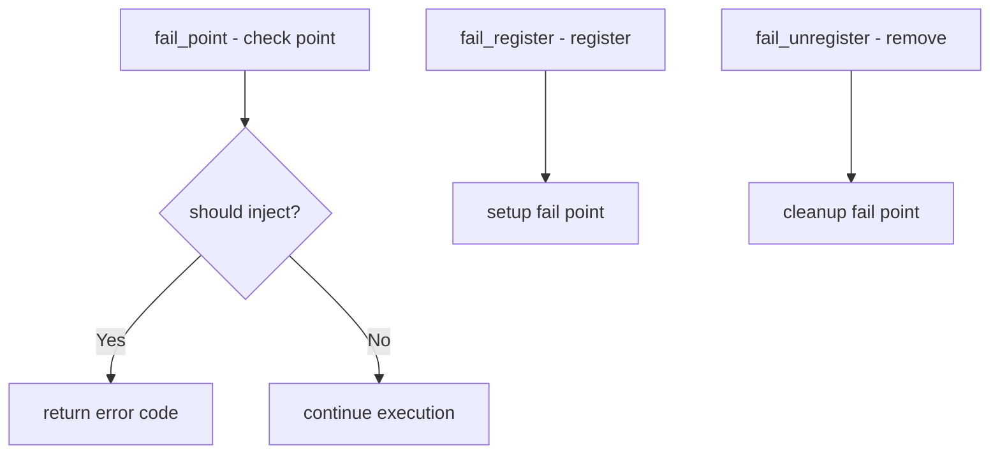

# Component: kern_fail.c

**Path:** `sys/kern/kern_fail.c`
**Type:** File
**Maps to:** `.discovery/sys/kern/kern_fail.md`

## Purpose

Fail(9) facility - runtime fault injection for testing. Allows injecting artificial failures (ENOMEM, EIO, etc.) into kernel code paths without recompiling. Used to verify error handling.

## Structure



## Key Functions

| Function | Purpose | Signature |
|----------|---------|-----------|
| `fail_point` | Check fail point | `int fail_point(void *val, int failtype, ...)` |
| `fail_register` | Register fail point | `int fail_register(const char *name, ...)` |
| `fail_unregister` | Unregister | `void fail_unregister(const char *name)` |
| `fail_parse_fault` | Parse fault spec | `int fail_parse_fault(const char *spec)` |

## Fail Point Types

| Type | Description |
|------|-------------|
| `FAIL_RET` | Return error |
| `FAIL_SLEEP` | Sleep then continue |
| `FAIL_PAUSE` | Pause thread |
| `FAIL_BREAK` | Breakpoint |

## Fault Specification

```
<count><op><arg>
```

| Op | Description |
|----|-------------|
| `+` | Increment counter |
| `-` | Decrement counter |
| `=` | Set to value |
| `%` | Return error percentage |
| `~` | Always fail |

## Example Usage

```c
fail_point(commissura port, FAIL_RET, ENOMEM);
if (fail_point(...))
    return (ENOMEM);
```

## Sysctl

| Node | Description |
|------|-------------|
| `debug.fail` | Fail point debug |

## Includes

- `sys/fail.h` - Fail point definitions

## Depends On

- `sys/sysctl.h` for debug interface
- `kernel` for module support