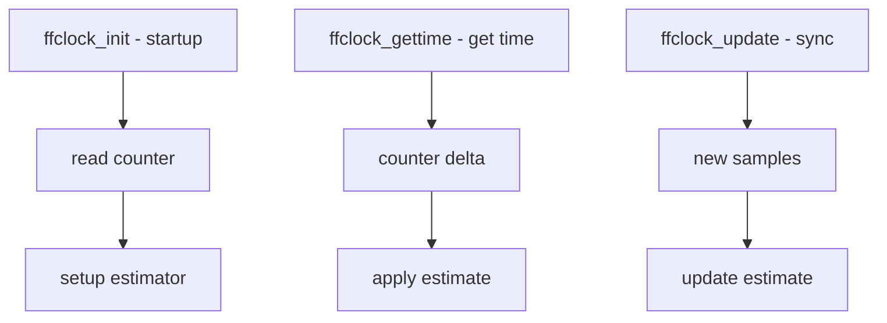

# Component: kern_ffclock.c

**Path:** `sys/kern/kern_ffclock.c`
**Type:** File
**Maps to:** `.discovery/sys/kern/kern_ffclock.md`

## Purpose

Feed-forward clock (ffclock) - alternative timekeeping using feed-forward algorithms. Provides more accurate timestamps than NTP feedback by using hardware counters and estimation algorithms.

## Structure



## Key Functions

| Function | Purpose | Signature |
|----------|---------|-----------|
| `ffclock_init` | Initialize | `int ffclock_init(void)` |
| `ffclock_gettime` | Get time | `int ffclock_gettime(struct timespec *ts)` |
| `ffclock_getclockres` | Get resolution | `int ffclock_getclockres(struct timespec *ts)` |
| `ffclock_uptime` | Get uptime | `void ffclock_uptime(struct bintime *bt)` |
| `ffclock_estimate` | Get estimate | `void ffclock_estimate(struct ffclock_estimate *est)` |

## Feed-Forward Estimate

```c
struct ffclock_estimate {
    int64_t cval;            // Counter value at last update
    int64_t offset;          // Offset from hardware
    uint64_t precision;       // Estimated precision
    uint64_t fcounter;       // Hardware frequency
    struct timespec l_update;// Last update time
    // ...
};
```

## FFClock vs NTP

| Aspect | FFClock | NTP |
|--------|---------|-----|
| Algorithm | Feed-forward | Feedback |
| Accuracy | Better | Good |
| Complexity | Higher | Lower |

## FFClock Sysctls

| Node | Description |
|------|-------------|
| `kern.ffclock` | Feed-forward clock |
| `kern.ffclock.estimate` | Current estimate |

## Includes

- `sys/timeffc.h` - FFClock definitions

## Depends On

- `kern_clocksource.c` for counters
- `machine/clock.h` for hardware