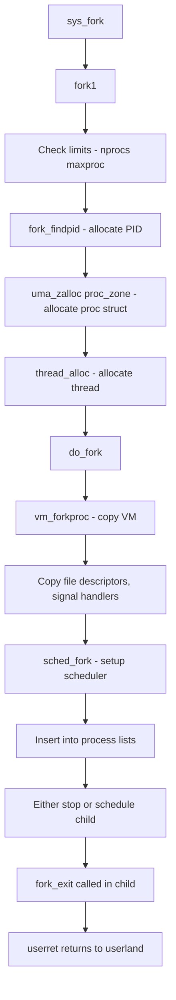
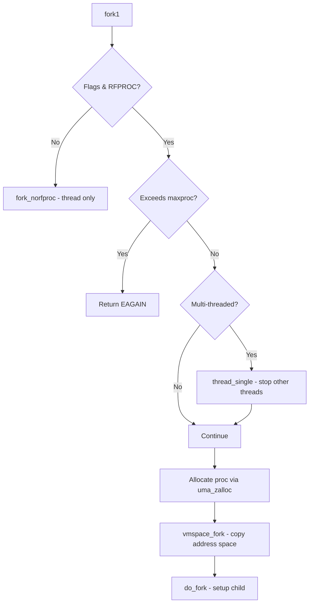
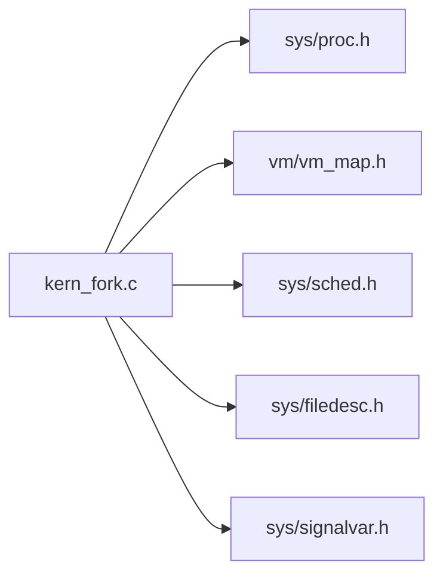

# sys/kern/kern_fork.c — Process Forking Codebase Map

**Path:** `sys/kern/kern_fork.c`
**Purpose:** Process and thread creation via fork

## File Overview

Implements fork, vfork, rfork, and pdfork system calls. Handles process creation, PID allocation, address space copying, and thread initialization.

## Key Functions

| Function | Purpose | Signature |
|----------|---------|-----------|
| `sys_fork()` | Standard fork syscall | `int sys_fork(struct thread *td, struct fork_args *uap)` |
| `sys_vfork()` | vfork syscall | `int sys_vfork(struct thread *td, struct vfork_args *uap)` |
| `sys_rfork()` | rfork syscall | `int sys_rfork(struct thread *td, struct rfork_args *uap)` |
| `sys_pdfork()` | Process descriptor fork | `int sys_pdfork(struct thread *td, struct pdfork_args *uap)` |
| `fork1()` | Core fork implementation | `int fork1(struct thread *td, struct fork_req *fr)` |
| `do_fork()` | Actual fork work | `static void do_fork(struct thread *td, struct fork_req *fr, struct proc *p2, struct thread *td2, struct vmspace *vm2, struct file *fp_procdesc)` |
| `fork_findpid()` | Find unused PID | `static int fork_findpid(int flags)` |
| `fork_exit()` | Handle child return | `void fork_exit(void (*callout)(void *, struct trapframe *), void *arg, struct trapframe *frame)` |
| `fork_return()` | Syscall return for child | `void fork_return(struct thread *td, struct trapframe *frame)` |

## Fork Flags

| Flag | Meaning |
|------|---------|
| `RFPROC` | Create new process (not just thread) |
| `RFFDG` | Copy file descriptors |
| `RFCFDG` | Close file descriptors in child |
| `RFPPWAIT` | Parent waits for child exec/exit |
| `RFMEM` | Share memory (vfork) |
| `RFTHREAD` | Create thread not process |
| `RFSTOPPED` | Create process stopped |
| `RFPROCDESC` | Return process descriptor |
| `RFNOWAIT` | Child reparented to init |

## Process Creation Flow

## fork1() Validation

## PID Allocation

- Uses `lastpid` counter with randomization via `randompid` sysctl
- Checks pid_max limit
- Uses bitmaps: `proc_id_pidmap`, `proc_id_grpidmap`, `proc_id_sessidmap`, `proc_id_reapmap`
- Finds first unused PID starting from lastpid + 1

## Key Includes

## Key Dependencies

| File | Purpose |
|------|---------|
| `vm_vmspace.c` | vmspace_fork() for copying VM |
| `sys_fork.c` | Machine-dependent fork |
| `thread_stoch.c` | Scheduler fork hooks |
| `proc.c` | Process list management |
| `filedesc.c` | File descriptor copying |